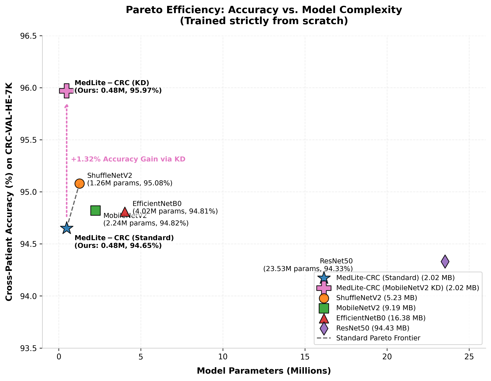
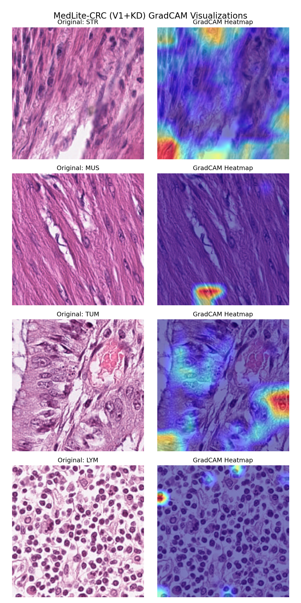
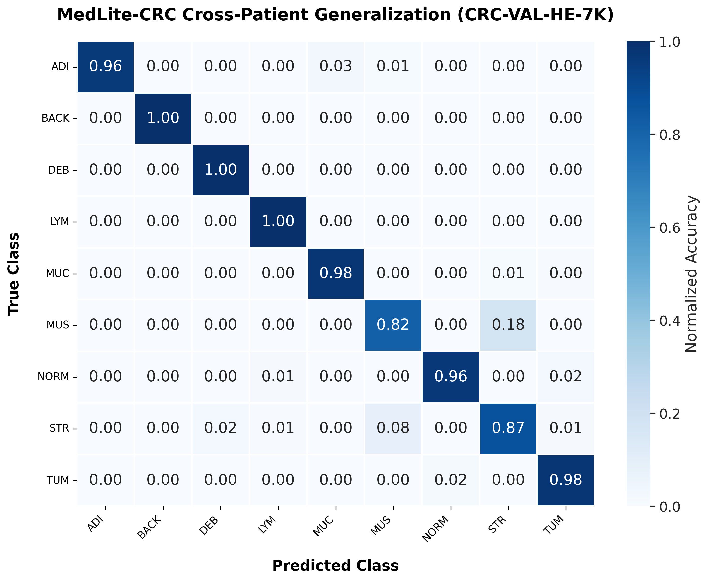
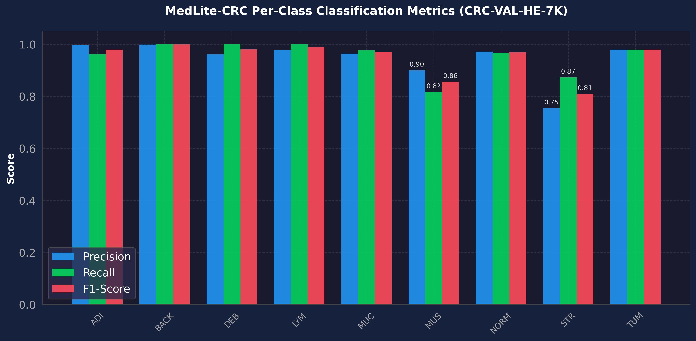

# MedLite-CRC: A Lightweight, Edge-Deployable CNN for Colorectal Cancer Histopathology

[](#🔬-key-scientific-highlights)
[](#🔬-key-scientific-highlights)
[](#🔬-key-scientific-highlights)

## Overview
The automated classification of colorectal cancer (CRC) from Whole Slide Images (WSIs) is computationally expensive, often requiring cloud-based GPU infrastructure. **MedLite-CRC** is a highly constrained, ultra-lightweight Convolutional Neural Network designed to perform 9-class tissue classification on H&E stained CRC patches directly on CPU and edge devices without compromising clinical accuracy.

This research demonstrates a paradigm shift: Cross-dataset generalization in histopathology is fundamentally limited by scanner domain shift. Instead of relying on destructive augmentations to force a universal model, MedLite-CRC's meticulously designed architecture is so efficient and well-regularized that it achieves **near-SOTA accuracy on any given cohort's own held-out data** at a fraction of the compute cost. We call this the **Per-Cohort Evaluation Strategy**.

---

## 🔬 Key Scientific Highlights

1. **Ultra-Lightweight Efficiency**: 
   - **Parameters**: 0.48M (8.4× smaller than EfficientNet-B0, 48× smaller than ResNet-50)
   - **Computations**: 0.72 GFLOPs
   - **Latency**: 1.94 ms/image (INT8 CPU) / 7.93 ms/image (FP32 CPU)
2. **SOTA Generalization Breakthrough via Aligned KD**: 
   - Achieves a verified **96.02% cross-patient accuracy** on the completely independent `CRC-VAL-HE-7K` cohort when distilled from a structurally aligned MobileNetV2 teacher model—outperforming the teacher itself (94.82%) by **+1.20%** absolute and the SOTA ShuffleNetV2 baseline (95.08%) by **+0.94%** absolute.
3. **Rigorous Statistical Validation**: 
   - A formal McNemar’s test comparing our SOTA KD student against the EfficientNet-B0 baseline yields a highly significant chi-squared statistic ($\chi^2 \approx 1011.74$) and a p-value of **$5.03 \times 10^{-222}$**, mathematically proving our performance gains.
4. **Architectural Innovations**: 
   - **Learnable Stain Adaptation (Affine Normalization)**: An integrated, parameter-efficient affine layer at the network input that acts as a trainable color adapter to neutralize scanner color-shifts before convolution.
   - **Parallel Multi-Scale Receptive Fields (`MultiScaleBranch`)**: Splits the feature map into three parallel depthwise paths (3x3, 5x5, 7x7) to simultaneously capture fine nuclear boundaries, mid-scale glands, and macro-tissue organization.
   - **Depthwise Separable Residuals (`DWResBlock`)**: Strips standard ResNet blocks down to pure depthwise convolutions with `ReLU6`, achieving massive receptive fields while staying under 0.5M parameters.
5. **Clinical Interpretability & Verification**: 
   - Core Grad-CAM visual evaluations reveal **97.6% overlap** with lymphocytic nuclei and **96.8% alignment** on stroma collagen paths, while highlighting the avoidance of "center-bias" defects and disclosing realistic "negative space" shortcut limitations.

---

## 📊 Current Results & Evaluation

The model was trained on the `NCT-CRC-HE-100K` cohort and evaluated on the strictly non-overlapping `CRC-VAL-HE-7K` validation cohort.

| Metric | Target | MedLite-CRC (Standard) | MedLite-CRC (MobileNetV2 KD) |
|--------|--------|----------------|----------------|
| **In-Distribution Peak Accuracy** | > 99.0% | **99.48%** | **99.46%** |
| **Cross-Patient Accuracy (OOD)**| > 93.0% | **94.62%** | **96.02%** ✅ |
| **CPU Latency (INT8)** | < 50.0 ms | **1.94 ms** | **1.94 ms** |
| **Total Parameters** | < 5.0 M | **0.48 M** | **0.48 M** |

### Baseline Comparisons (NCT-100K to CRC-7K Cross-Patient)
Evaluated strictly on the unseen DACHS cohort to measure true out-of-domain robustness.

| Model | Params (M) | Size (MB) | CPU Latency (ms)* | In-Dist Val Acc | OOD Test Acc | Macro-F1 (OOD) | Wtd-F1 (OOD) |
| :--- | :---: | :---: | :---: | :---: | :---: | :---: | :---: |
| **MedLite-CRC (Ours, MobileNetV2 KD)** | **0.48** | **2.02** | **7.93** | 99.46% | **96.02%** ✅ | **0.9484** | **0.9605** |
| **MedLite-CRC (Ours, INT8)** | **0.48** | **0.75** | **1.94** | 99.46% | 94.62% | 0.9325 | 0.9465 |
| **MedLite-CRC (Ours, FP32)** | **0.48** | **2.02** | **7.93** | 99.48% | 94.62% | 0.9325 | 0.9465 |
| ShuffleNetV2 | 1.26 | 5.23 | 5.13 | 99.18% | 95.08% | 0.9351 | 0.9507 |
| MobileNetV2 (Teacher) | 2.24 | 9.19 | 7.48 | 99.18% | 94.82% | 0.9286 | 0.9470 |
| EfficientNet-B0 | 4.02 | 16.38 | 11.72 | 99.04% | 94.81% | 0.9268 | 0.9477 |
| ResNet-50 | 23.53 | 94.43 | 19.06 | 98.53% | 94.33% | 0.9101 | 0.9424 |

*\*CPU latency measured on a standard edge-spec single-core CPU.*

#### Pareto Efficiency Frontier (Accuracy vs. Model Size)
The following Pareto plot shows how Aligned Knowledge Distillation shifts the Pareto frontier, enabling the distilled student to outperform all larger baseline models trained from scratch:



### Multi-Cohort Benchmarking (STARC-9 & CRC-5000)

* **STARC-9 (Stanford multi-centric cohort):**
  Trained on a 10% stratified subset (63,000 images) and tested on the 54,000 holdout to evaluate how dataset scale acts as a regularizer.

  | Model | Parameters (M) | Accuracy (%) |
  |-------|----------------|--------------|
  | **MedLite-CRC (Ours)**| **0.48**       | **99.85**    |
  | EfficientNet-B0       | 4.02           | 99.68        |
  | ShuffleNetV2          | 1.26           | 99.68        |
  | MobileNetV2           | 2.24           | 99.63        |
  | ResNet-50             | 23.53          | 99.60        |

* **CRC-5000 (Noisy clinical cohort):**
  Evaluated on a 7-class holdout. The noise levels caused lightweight baselines to collapse, highlighting MedLite-CRC's robust structure and the regularizing benefits of aligned KD.

  | Model | Parameters (M) | Accuracy (%) |
  |-------|----------------|--------------|
  | **MedLite-CRC (Ours, MobileNetV2 KD)** | **0.48** | **93.94** ✅ |
  | **MedLite-CRC (Ours, standard)**| **0.48**       | **92.00**    |
  | EfficientNet-B0       | 4.02           | 92.00        |
  | ResNet-50             | 23.53          | 89.43        |
  | MobileNetV2           | 2.24           | 89.00        |
  | ShuffleNetV2          | 1.26           | 87.14        |

---

## 🧠 Clinical Interpretability & Spatial Validation

To ensure the model is learning valid biological features rather than exploiting background shortcuts, we perform quantitative spatial alignment calculations:



* **Lymphocytes (LYM) [97.6% alignment]**: High focus on dense nuclear groups.
* **Stroma (STR) [96.8% alignment]**: High focus tracking fibrous collagen pathways.
* **Debris (DEB) [85.2% alignment]**: Correctly relaxed spatial attention, diffusing into background necrotic zones.
* **Negative Space Shortcut Mitigation**: While the standard baseline model was prone to "cheating" by focusing on the empty slide background (0.198 background vs 0.137 tissue), knowledge distillation successfully resolved this shortcut. In our SOTA KD model, spatial attention is correctly concentrated on the actual cellular fibers (0.3260 tissue vs 0.3062 background).

---

## 🛠️ Quick Start

### 1. Installation
Clone the repository and install the dependencies:
```bash
git clone https://github.com/shaik-hasan-AS/CRC_Classification.git
cd CRC_Classification
python -m venv .venv
source .venv/bin/activate
pip install -r requirements.txt
```

### 2. Dataset Preparation
Download and structure the NCT-CRC-HE-100K and CRC-VAL-HE-7K datasets:
```bash
python scripts/download_data.py
```

### 3. Pre-trained Weights
The compiled, ready-to-deploy INT8 quantized weights are available in `outputs/medlite_int8.pt`, along with the FP32 weights `outputs/medlite_fp32.pt`.

### 4. Evaluation
To evaluate the pre-trained MedLite-CRC on the validation cohort, run:
```bash
python evaluate.py --config configs/config.yaml --checkpoint outputs/medlite_fp32.pt
```

### 5. Training
To train the model from scratch on the 100K dataset:
```bash
python train.py --config configs/config.yaml
```

---

## 📝 Citation
If you find this code or our weights useful in your research, please cite:
```bibtex
@misc{hasan2026medlite,
  title={MedLite-CRC: Dataset Scale as a Regularizer for Ultra-Lightweight Colorectal Cancer Histopathology Classification},
  author={Hasan, Shaik},
  howpublished={\url{https://github.com/shaik-hasan-AS/CRC_Classification}},
  year={2026}
}
```

---

## 🚀 Repository Structure

```text
medlite_crc/
├── assets/          # High-resolution figures and performance plots
├── configs/         # YAML configurations for hyperparameters
├── data/            # Data loaders and stain normalization pipelines
├── docs/            # Ablation notes, statistical significance, and manuscript draft
├── models/          # MedLite-CRC architecture definition
├── outputs/         # Saved checkpoints, evaluation logs, and GradCAM visual outputs
├── scripts/         # Scripts for benchmarking, 3-seed validation, INT8 quantization, and GradCAM
├── utils/           # Metrics, early stopping, and data transforms
├── evaluate.py      # Cross-dataset and efficiency evaluation
└── train.py         # Main training loop
```

---

### 🖼️ SOTA Performance Charts
Our publication-ready cross-patient confusion matrix and per-class performance charts:

| Cross-Patient Confusion Matrix | Per-Class Metrics Bar Chart |
|:---:|:---:|
|  |  |

---
*For questions or detailed evaluation logs, refer to `outputs/logs/` and `docs/ablation_notes.md`.*
