# 🖼️ Colorectal Cancer Histopathology Dataset Gallery
This gallery showcases sample patch-level and biopsy-level images for all pathological classes across all 7 colorectal cancer histopathology datasets.
## NCT-CRC-HE-100K (Germany, Multicentric Train/Val)
| Class | Sample Image |
| :--- | :--- |
| **ADI** | 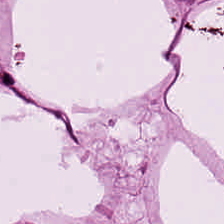 |
| **BACK** | 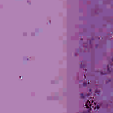 |
| **DEB** | 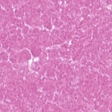 |
| **LYM** | 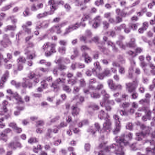 |
| **MUC** | 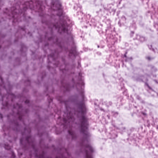 |
| **MUS** | 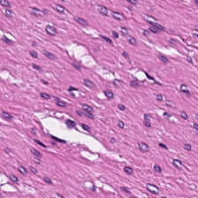 |
| **NORM** | 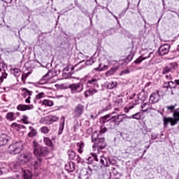 |
| **STR** | 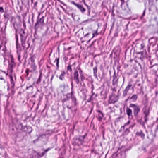 |
| **TUM** | 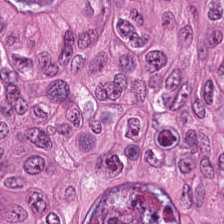 |

---

## CRC-VAL-HE-7K (Germany, Out-of-Distribution Test)
| Class | Sample Image |
| :--- | :--- |
| **ADI** | 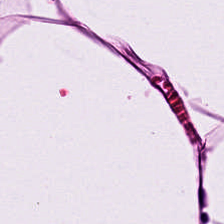 |
| **BACK** | 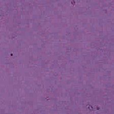 |
| **DEB** | 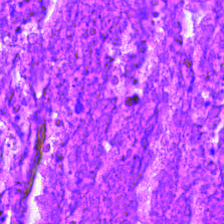 |
| **LYM** | 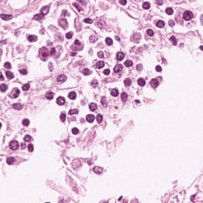 |
| **MUC** | 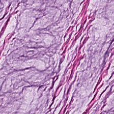 |
| **MUS** | 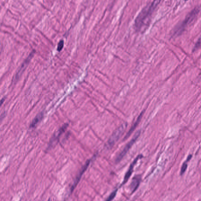 |
| **NORM** | 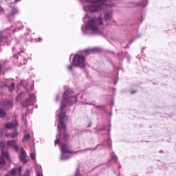 |
| **STR** | 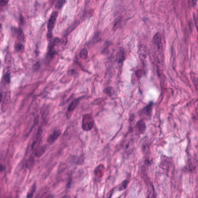 |
| **TUM** | 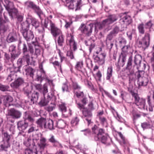 |

---

## STARC-9 (Stanford Multi-Centric Cohort)
| Class | Sample Image |
| :--- | :--- |
| **ADI** | 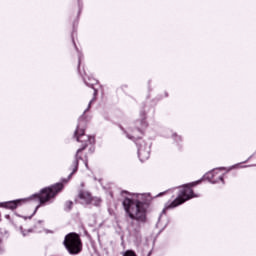 |
| **BACK** | 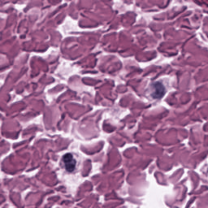 |
| **DEB** | 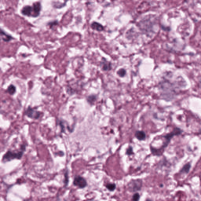 |
| **LYM** | 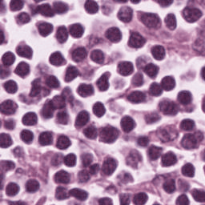 |
| **MUC** | 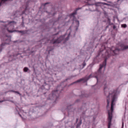 |
| **MUS** | 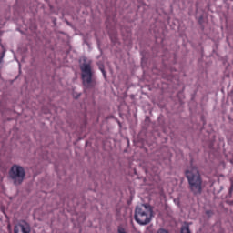 |
| **NORM** | 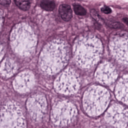 |
| **STR** | 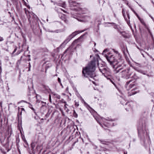 |
| **TUM** | 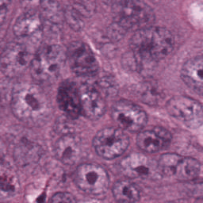 |

---

## CRC-5000 (Kather et al. 2016, Legacy/Noisy)
| Class | Sample Image |
| :--- | :--- |
| **ADI** | 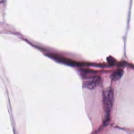 |
| **BACK** |  |
| **DEB** | 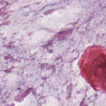 |
| **LYM** | 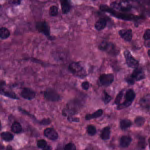 |
| **NORM** | 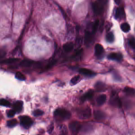 |
| **STR** | 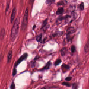 |
| **TUM** | 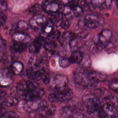 |

---

## EBHI-SEG (Biopsy Tissue Classification)
| Class | Sample Image |
| :--- | :--- |
| **Adenocarcinoma** | 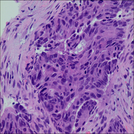 |
| **High-grade IN** | 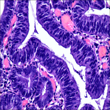 |
| **Low-grade IN** | 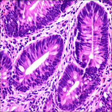 |
| **Normal** | 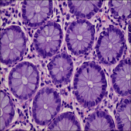 |
| **Polyp** | 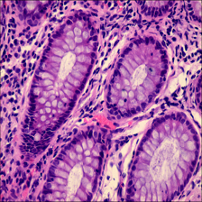 |
| **Serrated adenoma** | 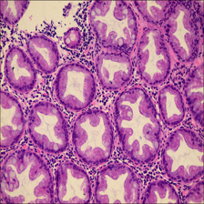 |

---

## CRC-HGD-v1 (Histopathology Grading Classification)
| Class | Sample Image |
| :--- | :--- |
| **CRC_Grade__1__Well_Diff** | 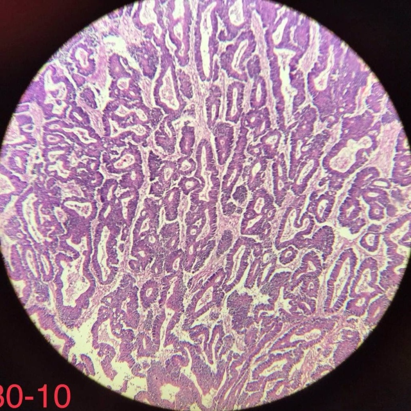 |
| **CRC_Grade__2__Mod_Diff** | 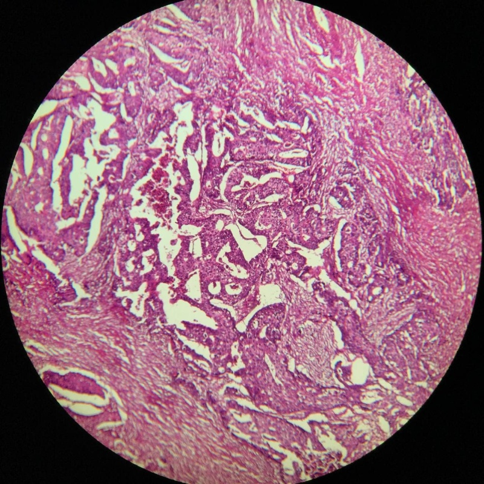 |
| **CRC_Grade__3__Poorly_Diff** | 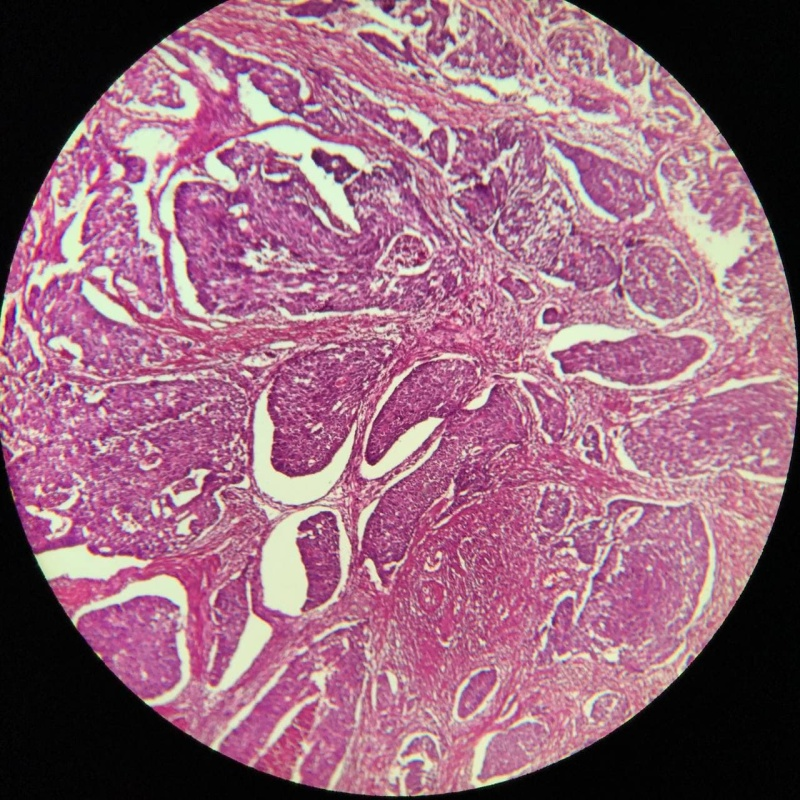 |
| **Mixed_Normal_Tumoral_Colon** | 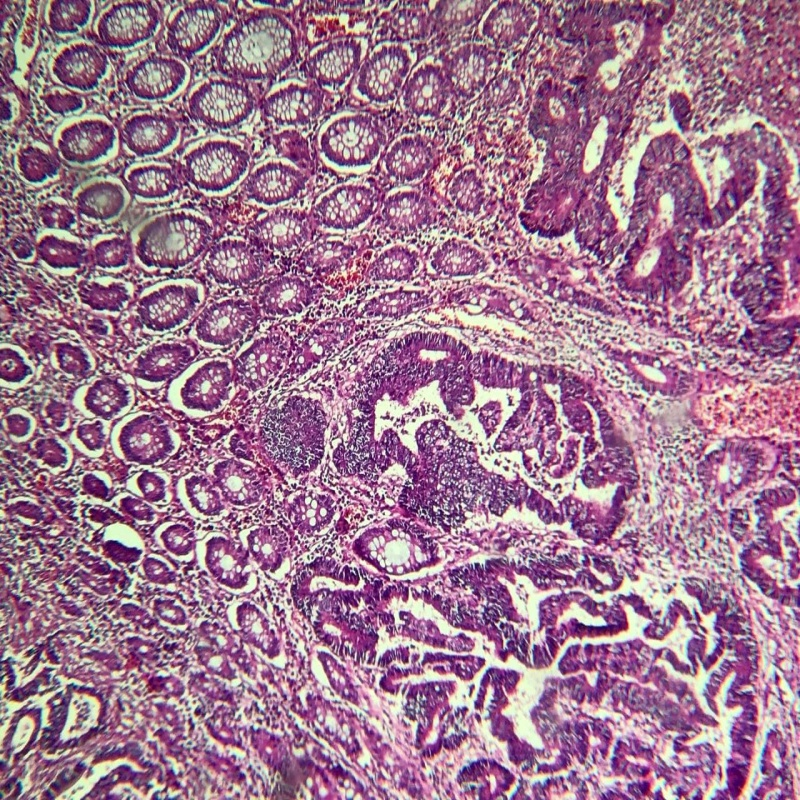 |
| **Normal_Colon** | 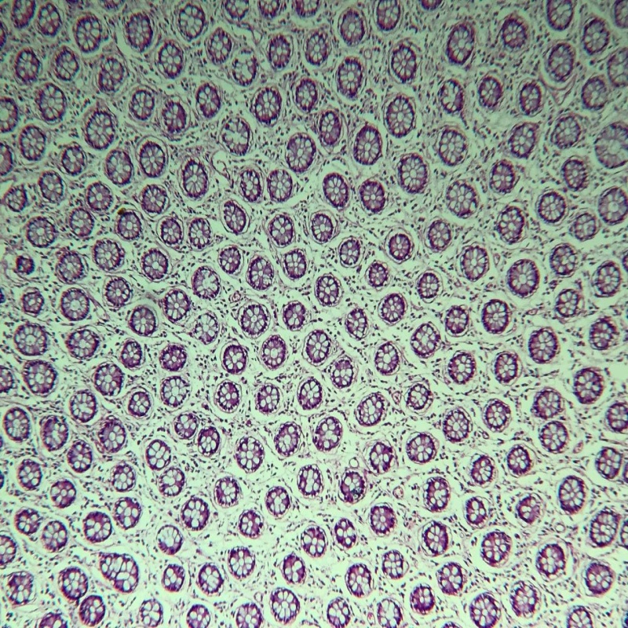 |

---

## Kather MSI/MSS (TCGA Colorectal Patches)
| Class | Sample Image |
| :--- | :--- |
| **MSS** | 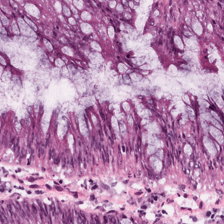 |
| **MSIMUT** | 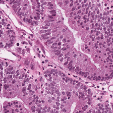 |

---

