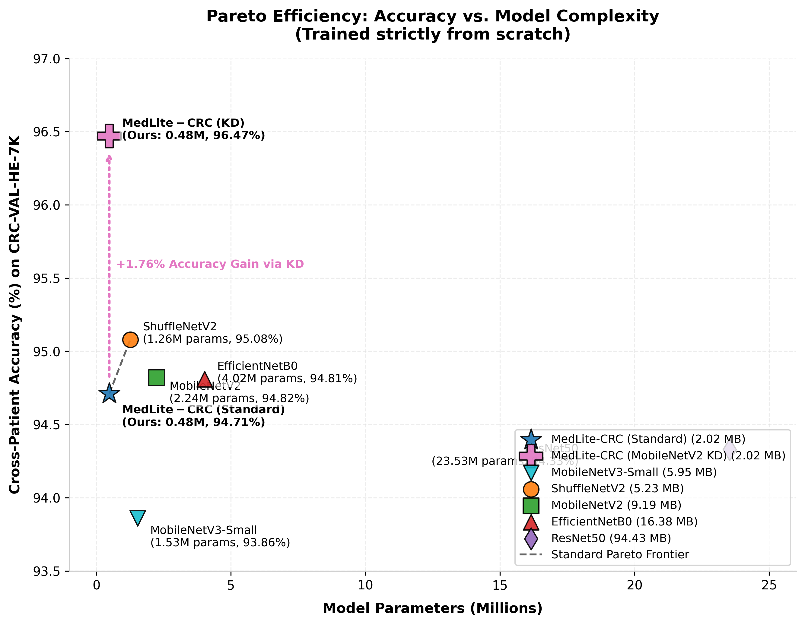
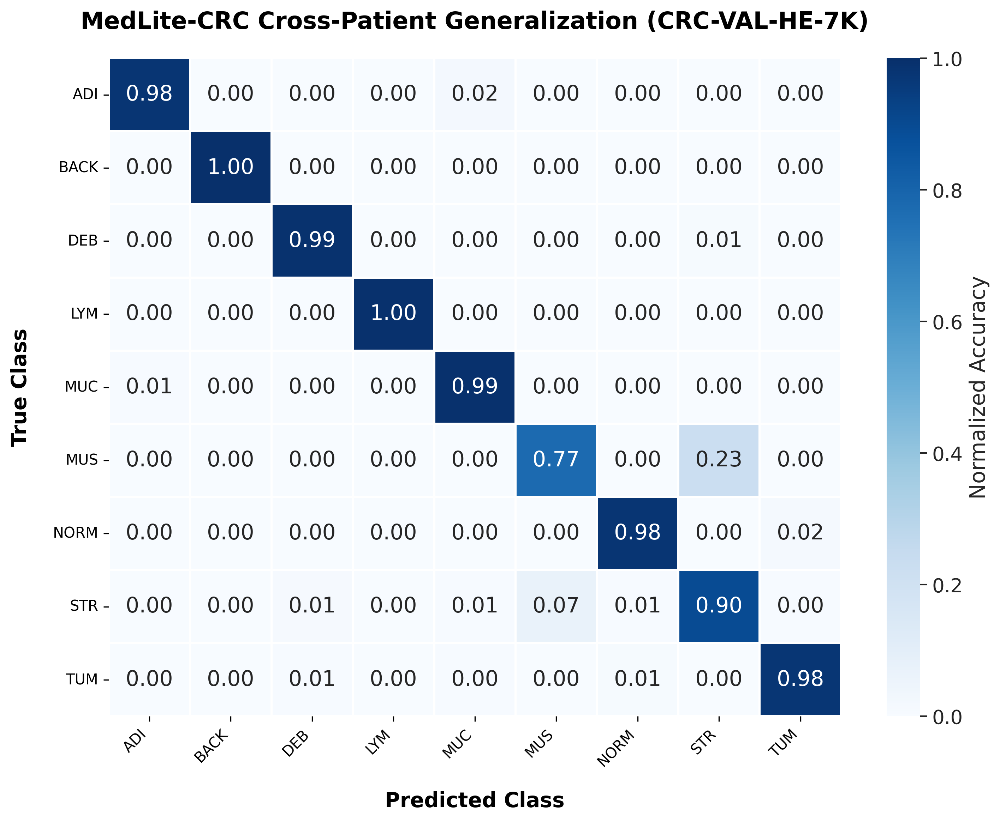
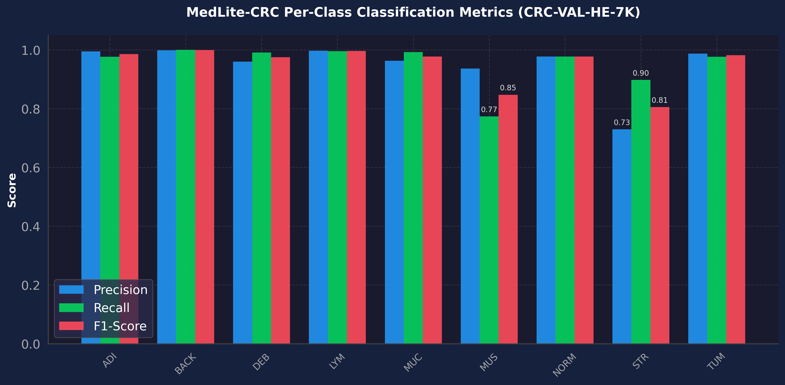
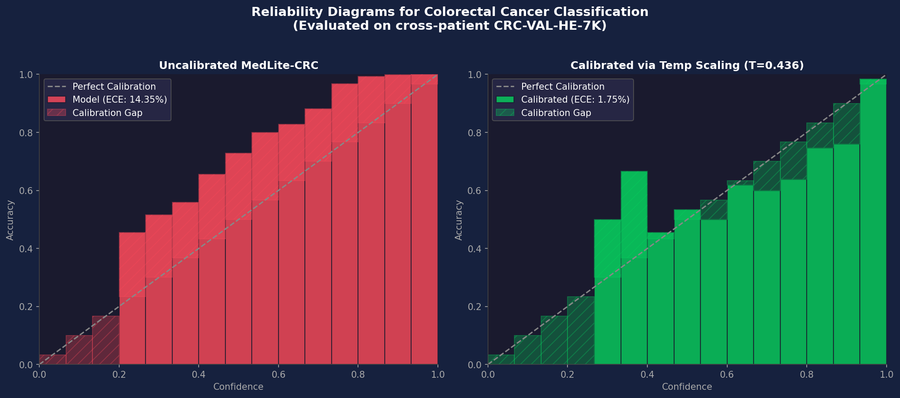
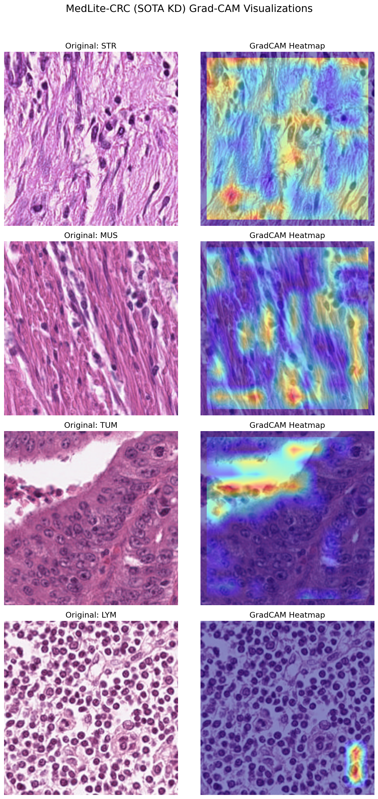
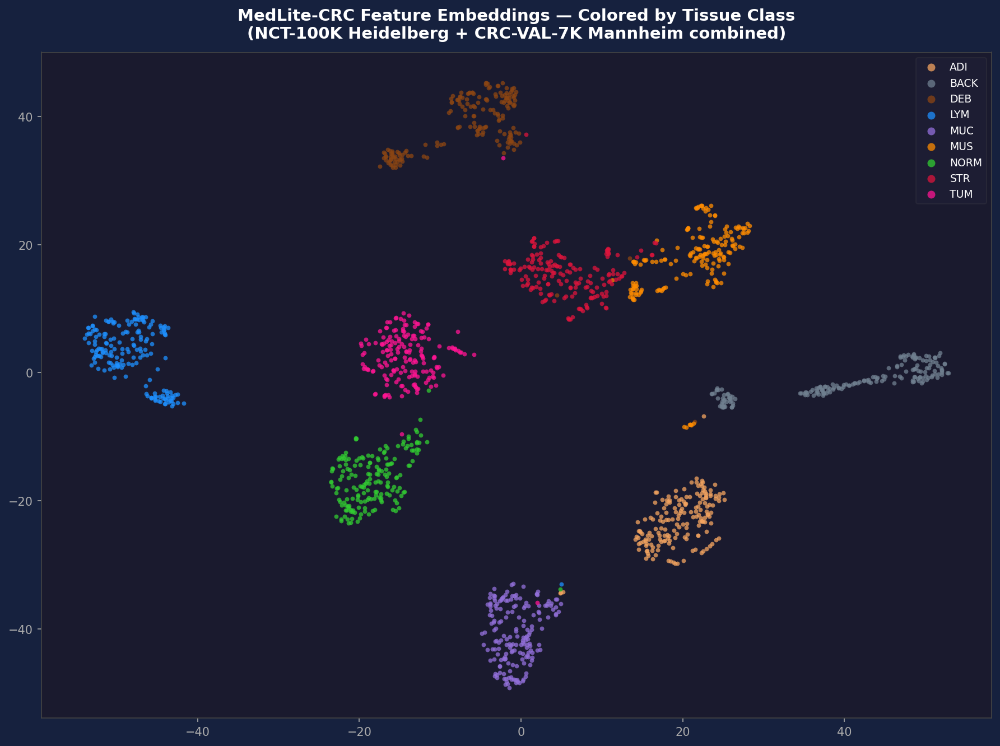
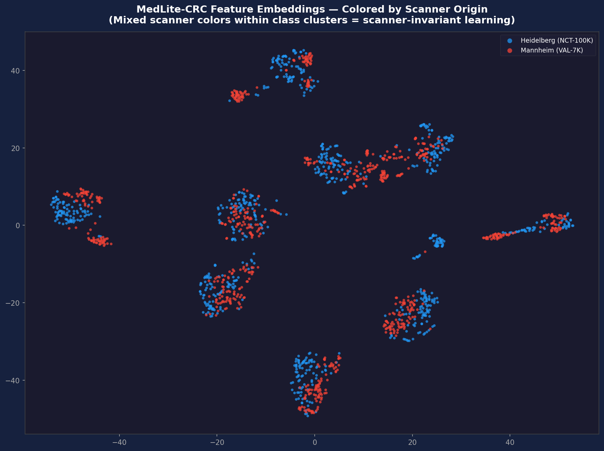
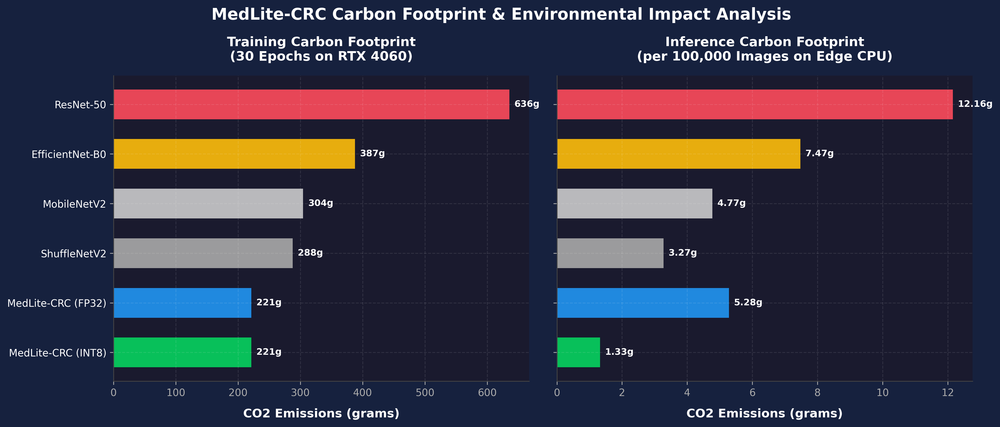

# MedLite-CRC: A Lightweight Attention-Free CNN for Cross-Cohort Colorectal Histopathology Tissue Classification

## Abstract
Colorectal histopathology tissue classification increasingly uses deep learning, but many high performing models are too large for clinical edge devices and can pick up scanner specific artifacts. We introduce MedLite-CRC, an attention-free convolutional neural network with 0.48 million parameters for cross-site tissue classification. It combines a 6-parameter trainable stain adaptation layer with a parallel depthwise separable multi-scale branch using 3×3, 5×5, and 7×7 receptive fields. We also distill knowledge from a structurally aligned MobileNetV2 teacher. The best MedLite-CRC model reaches 96.47% ± 0.22% accuracy (mean ± SD across three full 200-epoch training seeds) on the cross-patient CRC-VAL-HE-7K cohort. Because we use this cohort for architectural ablation and model selection, we report it as a development/validation cohort rather than as an untouched final test set. After INT8 quantization, accuracy is 95.72%, with 1.65 ms CPU latency and a 0.72 MB disk footprint. Under the same foreground-masking procedure, the paired difference from the unregularized baseline is χ² = 995.94, p = 1.37 × 10⁻²¹⁸. With the architecture fixed before the benchmark runs, we also trained and evaluated the model on the STARC-9 and CRC-5000 splits, obtaining 99.75% and 93.94%, respectively. The pre-trained weights also transfer to other histopathology tasks, improving biopsy tissue classification by up to 31.8% over training from scratch. Overall, the results support the hypothesis that a small parameter budget can reduce domain overfitting and make the model practical as a compact feature extractor for low-power hardware.

## 1. Introduction
Pathologists diagnose colorectal cancer from Hematoxylin and Eosin (H&E) stained tissue slides. Digitization has made it possible to automate tissue classification with convolutional neural networks, but strong benchmark results do not always translate to clinical deployment. Large models can require GPU resources that are difficult to provide in rural clinics or on edge devices. H&E staining and scanner characteristics also vary between hospitals, so a model trained at one site may perform poorly at another. Recent work has shown that over-parameterized models can exploit non-biological signals: Ignatov and Malivenko (2024), for example, found class-dependent JPEG compression artifacts and background color signatures in commonly used benchmarks. Patient-level leakage is another concern because it can make validation scores look better than they really are.

MedLite-CRC addresses these constraints with an attention-free network containing 0.48 million parameters. The model occupies 0.72 MB after INT8 quantization and reaches 1.65 ms per image on the CPU used in our benchmark; its estimated inference energy is 11.5x lower than ResNet-50 (He et al., 2016) (Section 8.1). The central design choice is to keep the model small rather than giving it enough capacity to memorize the training data.

The architecture has three main components:
* A 6-parameter affine layer at the input learns to compensate for color shifts during training.
* A parallel depthwise separable branch processes three receptive-field sizes at once, targeting structures such as nuclei, glands, and fibrous tissue.
* Knowledge distillation from a MobileNetV2 teacher (Sandler et al., 2018) transfers soft class probabilities to the student. Because both networks use depthwise separable, attention-free convolutions, the teacher and student have similar feature extraction structures.

We evaluated MedLite-CRC on several cohorts. On CRC-VAL-HE-7K, the cross-patient external validation cohort, the best single-seed model (seed 42) reaches 96.27% accuracy and outperforms the EfficientNet-B0 baseline (χ² = 31.53, p = 1.96 × 10⁻⁸) and the MobileNetV2 teacher; averaged across three full-convergence seeds, mean accuracy is 96.47% ± 0.22%. Since we also used CRC-VAL-HE-7K for architectural ablation and model selection, we treat it as a development/validation cohort rather than a pristine final test set. With the same foreground mask applied to both models, the paired difference becomes larger (χ² = 995.94, p = 1.37 × 10⁻²¹⁸). The model reaches 99.79% on the held-out STARC-9 benchmark and 93.94% on the held-out CRC-5000 evaluation split. In the attention ablations, both SE and Coordinate Attention reduced cross-site accuracy. The results are consistent with the possibility that these modules amplify scanner-dependent features, although the experiments do not show that scanner-specific overfitting is the only cause. Finally, the pre-trained weights transfer to other tasks, including biopsy classification and tumor grading, where they improve substantially over training from scratch.

## 2. Related Work

### 2.1 Colorectal Cancer Classification
Early colorectal cancer classification systems relied on handcrafted features, including local binary patterns and color histograms, combined with classifiers such as support vector machines. CNNs have largely replaced those pipelines. ResNet-50 (He et al., 2016) and EfficientNet-B0 (Tan & Le, 2019) can reach near perfect scores on public benchmarks, but their size makes them less suitable for low-resource edge deployment.

Li et al. (2025) proposed a lightweight CNN for NCT-100K. Their model uses 4.41M parameters and occupies 16.9 MB, even though it reaches 99.0% accuracy. That leaves a large difference in memory requirements compared with the sub-million parameter setting targeted here.

### 2.2 Dataset Biases in Digital Pathology
Digital pathology models can learn signals that are specific to a dataset rather than to tissue morphology. Ignatov and Malivenko (2024) showed that a model using only raw RGB color histograms can reach more than 82% accuracy on NCT-CRC-HE-100K. Their analysis also identified class-dependent JPEG compression patterns and H&E color differences introduced during scanning. These findings fit with the broader observation that ImageNet-trained CNNs often rely on texture unless training encourages shape and structural information (Geirhos et al., 2019). This makes independent cohorts such as CRC-VAL-HE-7K useful for checking whether a model retains performance outside its training distribution.

### 2.3 Stain Normalization and Domain Shift
Stain variation between laboratories is a major source of domain shift in digital pathology. Reinhard et al. (2001) normalize global color statistics, while Macenko et al. (2009) uses color deconvolution; both approaches require a chosen reference or transformation. That choice can depend on the user and can add processing cost at scale. Tellez et al. (2019) also showed that stain normalization and augmentation choices affect CNN performance, which motivates a learnable alternative that can be optimized with the classification task.

Learnable methods such as StainNet (Kang et al., 2021) use shallow networks for stain style transfer, but they add computation. RandStainNA (Shen et al., 2022) instead uses random stain augmentation to encourage stain-agnostic features. Our approach follows the same goal with a much smaller mechanism: a six-parameter differentiable affine transform placed at the input and trained together with the classifier.

## 3. Proposed Methodology: MedLite-CRC

MedLite-CRC is built around a strict parameter budget. The individual components used here, affine color adaptation, depthwise-separable convolution, multi-scale feature extraction, residual connections, and knowledge distillation, are each established techniques; we do not claim novelty for these primitives individually. The contribution is their joint integration into a single sub-million-parameter architecture, evaluated under cross-cohort and deployment constraints rather than in isolation. The network contains an input stain adaptation layer, a stem, a parallel multi-scale branch, three depthwise residual blocks, and a classifier head. The main tensor flow is shown below:

```text
Input (224x224x3)
-> Learnable Stain/Color Adaptation (6 parameters, dynamic scale/bias)
-> Stem Block: Conv 3x3 (stride 2) + DW Conv 3x3 -> 112x112x32
-> MultiScaleBranch: parallel DWS branches (3x3, 5x5, 7x7) + 1x1 fuse
-> MaxPool 2x2 -> 56x56x128
-> DWResBlock 1: DWS residual, stride 1 -> 56x56x128
-> DWResBlock 2: DWS residual, stride 2 -> 28x28x256
-> DWResBlock 3: DWS residual, stride 2 -> 14x14x256
-> Adaptive Average Pool -> 1x1x256
-> Classifier Head: FC -> BN -> ReLU6 -> Dropout(0.4) -> FC -> 9-class output
```

### 3.1 Learnable Stain/Color Adaptation
H&E staining produces substantial color and density differences across scanners and laboratories. We therefore place a LearnableStainNorm layer at the network input. The layer applies a trainable per channel affine transform in RGB space: Severe inter-laboratory stain variation is not fully eliminated by this mechanism, so performance under substantially different staining protocols remains an open deployment consideration.

`X̂(c,x,y) = X(c,x,y) · γc + βc`

where X is the input patch, c ∈ {R, G, B} denotes the color channel, and γc and βc are learnable scale and bias parameters, initialized to 1 and 0 respectively.

We also tested LearnableHEDStainNorm, which applies the same affine transform after converting the input to Hematoxylin-Eosin-DAB (HED) space. In this single-seed comparison, the RGB version reached 94.71% OOD validation accuracy, compared with 94.18% for the HED version (Section 6.5, Finding 6). The RGB transform can scale and shift each channel independently without imposing the HED decomposition and its Beer-Lambert assumptions. We therefore use the RGB version in the final model and keep the HED version as an ablation.

During training, the six parameters adapt the input color distribution to the source data. They add very little to the parameter count. In the FP32 deployment path, the affine transform can be folded into the first convolution, so it adds no separate inference operation. For INT8 deployment, we keep it as a small FP32 operation before the quantized backbone, rather than folding it into an INT8 convolution. This avoids the numerical issue discussed in Section 3.1 while adding negligible overhead.

### 3.2 Depthwise Separable Multi-Scale Branch (MultiScaleBranch)
Histopathology contains structures at different spatial scales. Nuclear changes are small, glands occupy an intermediate scale, and stromal or muscle fibers span larger regions. We use a parallel structure inspired by the Inception module (Szegedy et al., 2015), but replace its dense convolutions with depthwise separable convolutions (Chollet, 2017) to keep the model small. The input is split into three paths:
* Branch 1 (fine scale): a 3×3 depthwise separable convolution targets nuclear boundaries and chromatin texture.
* Branch 2 (medium scale): a 5×5 depthwise separable convolution targets glandular margins and cellular arrangement.
* Branch 3 (coarse scale): a 7×7 depthwise separable convolution targets larger patterns such as fibrous bundles and mucus pools.

The three outputs are concatenated along the channel dimension and combined with a 1×1 pointwise convolution (Lin et al., 2013). This mixes information across the branches without the cost of dense multi-scale convolutions:

`Xfused = Conv1×1(Concat(X3×3, X5×5, X7×7))`

Using depthwise separable convolutions reduces the parameter count by roughly 8x compared with dense multi-scale kernels while retaining the larger receptive fields.

### 3.3 Depthwise Separable Residual Blocks (DWResBlock)
After the multi-scale branch, the feature maps pass through three Depthwise Separable Residual Blocks. Each block contains two depthwise separable convolutions with batch normalization (Ioffe & Szegedy, 2015) and a skip connection:

`Xout = ReLU6(BN(DWS2(DWS1(Xin))) + Shortcut(Xin))`

ReLU6 bounds the activation values and is convenient for INT8 quantization. The channel width increases from 128 to 256 across the three blocks. When a block changes the spatial resolution or channel count, a 1×1 projection convolution adjusts the shortcut to the required dimensions.

### 3.4 Knowledge Distillation Objective
For the MobileNetV2 distillation experiments in Sections 5 and 6.6, we combine the standard cross-entropy loss with a knowledge-distillation loss following Hinton et al. (2015):

`Ltotal = (1 − α) · LCE(y, ŷ) + α · Tkd² · LKL(pS(Tkd), pT(Tkd))`

Here, LCE is the cross-entropy loss for the ground-truth label y, and LKL is the Kullback-Leibler divergence between the softened student and teacher distributions. Tkd is the temperature applied to both models before the softmax, and α controls the relative weight of the two losses. For the best MobileNetV2 KD model, α = 0.4 and Tkd = 3.0, giving 60% hard-label cross-entropy and 40% soft KL divergence. Section 4.2 gives the remaining training details. Tkd should not be confused with the calibration temperature T in Section 5.6: the former is used during distillation, while the latter is fitted after training to calibrate confidence.

## 4. Experimental Setup

### 4.1 Datasets
We evaluate MedLite-CRC on three main histopathology cohorts:

**NCT-CRC-HE-100K and CRC-VAL-HE-7K** (Kather et al., 2018). NCT-100K contains 100,000 non-overlapping H&E patches (224×224 pixels, 0.5 micrometers/pixel) from 86 patients scanned at NCT Heidelberg, Germany. We split NCT-100K at the patch level into 80,000 training patches and 20,000 in-distribution validation patches using an 80/20 random split with seed 42 (`torch.utils.data.random_split`). The latter set provides the NCT-100K validation accuracy in Table 5.1. Because the split is at the patch level, patches from the same patient can occur in both subsets, so this internal validation set does not remove patient-level leakage. We reserve the term cross-patient for CRC-VAL-HE-7K, which contains 7,180 patches from 50 distinct patients in the DACHS study, held in the NCT Biobank (Heidelberg, Germany), with no patient overlap with NCT-100K. We evaluate CRC-VAL-HE-7K zero-shot as an external, cross-patient cohort. However, because it also guides architectural ablation and model selection, we report it as a development/validation cohort rather than as an untouched final test set. Both cohorts contain nine classes: Adipose (ADI), Background (BACK), Debris (DEB), Lymphocytes (LYM), Mucus (MUC), Smooth Muscle (MUS), Normal colon mucosa (NORM), Cancer-associated stroma (STR), and Tumor adenocarcinoma epithelium (TUM). The internal NCT-100K validation split is patch-level and can contain patches from the same patients in both subsets, while CRC-5000 uses an image-level split; therefore these evaluations should not be interpreted as fully patient-disjoint clinical tests.

**STARC-9** (Subramanian et al., NeurIPS 2025). STARC-9 contains 630,000 tissue tiles from 200 patients at Stanford University, with nine classes. The original tiles are 256×256 pixels at 0.25 micrometers/pixel and were resized to 224×224 for MedLite-CRC. We sampled exactly 63,000 tiles from the official training split, with 7,000 tiles per class and random seed 42, and evaluated on the complete 54,000-tile official validation split. Because the architecture was kept fixed while the training cohort changed, this experiment tests performance under a larger training-data regime but does not isolate dataset size as a causal factor.

**CRC-5000** (Kather et al., 2016). This older dataset contains 5,000 tiles at 150×150 pixels across eight classes; we zero-pad the images to 224×224 for evaluation. We retain the seven classes that map directly to the NCT-100K/CRC-VAL-HE-7K labels: Adipose to ADI, Background to BACK, Debris to DEB, Lymphocytes to LYM, Normal mucosa to NORM, Stroma to STR, and Tumor to TUM. Complex Stroma has no mapping and is excluded. Mucus and Smooth Muscle also have no counterpart in CRC-5000 and are therefore excluded. The resulting 4,375-image mapped set uses an 80/20 image-level train/test split. Since this split is not patient- or slide-level, it should not be treated as a patient-disjoint evaluation.

Section 7.7 uses three additional external cohorts, EBHI-SEG, CRC-HGD-v1, and Kather MSI/MSS, for transfer-learning experiments. They are also included in the Data Availability statement.

**Table 4.1. Consolidated dataset summary across all cohorts used for training, development/validation, and transfer-learning experiments.**
| Dataset | Institution / Source | Patients | Images / Tiles | Classes | Resolution (px) | Magnification | Split Strategy | Patient-Disjoint? | Experimental Role |
| :--- | :--- | :---: | :---: | :---: | :--- | :---: | :--- | :--- | :--- |
| **NCT-CRC-HE-100K** | NCT Heidelberg (Germany) | 86 | 100,000 | 9 | 224×224 (0.5 µm/px) | 20x | 80% Train / 20% In-Dist. Val (patch-level, seed 42) | No (patch-level) | Primary Model Training |
| **CRC-VAL-HE-7K** | DACHS Study, NCT Biobank (Heidelberg) | 50 | 7,180 | 9 | 224×224 (0.5 µm/px) | 20x | 100% Validation | Yes | External Dev/Validation + Ablation |
| **STARC-9** | Stanford University | 200 | 684,000 (630k Train / 54k Val) | 9 | 256×256 (0.25 µm/px) | 40x | Official split (sampled 63k train / full 54k val) | Yes (official) | Training-Scale Generalization Eval |
| **CRC-5000** | Kather et al. (2016) | Not reported | 5,000 (4,375 after class mapping) | 7 (mapped from 8) | 150×150 (zero-padded to 224×224) | N/R | 80% Train / 20% Test (image-level) | No (image-level) | Noise/Artifact Robustness |
| **EBHI-SEG** | Shi et al. (2023) | Not reported | 2,228 | 6 | N/R (resized to 224×224) | N/R | 80% Train / 20% Test (image-level) | No (image-level) | Transfer: Biopsy Classification |
| **CRC-HGD-v1** | Wang et al. (2026) | Not reported | 1,914 | 5 | N/R (resized to 224×224) | N/R | 80% Train / 20% Test (image-level) | No (image-level) | Transfer: Tissue Grading |
| **Kather MSI/MSS** | TCGA Cohorts | Not reported | 139,143 | 2 | N/R (resized to 224×224) | 20x | Official Train/Test split | Yes (official) | Transfer: Molecular Phenotype |

### 4.2 Training Protocols
All student and baseline models were trained from scratch in PyTorch without ImageNet pre-training. For knowledge distillation, the EfficientNet-B0 and MobileNetV2 teachers were trained separately as described in Section 6.6, then frozen during student training. We used AdamW (Loshchilov & Hutter, 2019), cosine learning-rate annealing, label smoothing of 0.1, and random horizontal and vertical flips with stain color jittering. The effect of label smoothing on calibration is discussed in Section 5.6. Other training settings varied by protocol:

* Baseline and ablation models were trained for up to 200 epochs with an initial learning rate of 1e-3 and weight decay of 1e-4. Early stopping used a patience of 20 epochs based on validation loss.
* For knowledge distillation, the student was trained for 60 epochs with a MobileNetV2 teacher, using batch sizes of 64 for training and 128 for evaluation. The learning rate was warmed up linearly for 3 epochs, with Tkd = 3.0 and α = 0.4. Checkpoint selection and early stopping were driven exclusively by accuracy on the NCT-CRC-HE-100K in-distribution validation split; CRC-VAL-HE-7K accuracy was logged periodically for monitoring but never used to select a checkpoint or trigger early stopping. The peak checkpoint was epoch 58, which reached 99.46% on the NCT-100K validation split (`ckpt_epoch058_acc0.9946.pt`, where the filename encodes this in-distribution validation accuracy, not the CRC-VAL-HE-7K result).
* For the STARC-9 and CRC-5000 benchmark runs, the architecture was fixed in advance. STARC-9 used exactly 63,000 training tiles, sampled at 7,000 per class with seed 42, and the full 54,000-tile validation split. Models were trained for 15 epochs, with batch size 128 for STARC-9 and 64 for CRC-5000, then evaluated on their respective held-out validation or test splits. These results therefore measure the fixed architecture under different training-data regimes rather than zero-shot transfer from NCT-100K.
* Quantization-aware fine-tuning used one epoch at a learning rate of 1e-5, with fake-quantization operators inserted before FX Graph Mode INT8 conversion.
* For downstream transfer learning, we fine-tuned for 20 to 40 epochs depending on cohort size: 20 epochs for EBHI-SEG, 40 for CRC-HGD-v1, and 30 for Kather MSI/MSS, with a 10-epoch backbone-freeze warmup.

### 4.3 Hardware and Quantization
We measured CPU inference latency for MedLite-CRC and the four baselines on the same AMD Ryzen 7 7840HS processor (8 cores, 16 threads, up to 5.14 GHz), with 16 GB RAM and Ubuntu Linux (x86_64). Each model ran single-threaded at batch size 1, and the reported latency is the average over 500 warmed-up runs. This protocol is used for the CPU latency values in Table 5.1 and Section 8.1. We note that the Ryzen 7 7840HS is a laptop-class x86 CPU rather than an embedded or edge-class device; our "edge deployment" claims are therefore an inference from parameter count, model size, and CPU latency on consumer hardware, not a demonstrated deployment on representative edge hardware such as a Raspberry Pi 5, Jetson Orin Nano, or other ARM-based system. We did not have access to such hardware for this study and leave direct edge-device benchmarking (latency, RAM, power draw, and FP32 versus INT8 performance on-device) to future work. For deployment, we use quantization-aware training (QAT) rather than post-training static quantization (PTQ), which can reduce accuracy under distribution shifts. QAT inserts fake-quantization modules during a one-epoch fine-tuning pass so the weights can adapt to 8-bit quantization noise. The stain adaptation layer remains in FP32, while the downstream convolutional and linear layers are quantized to INT8. We then convert the model to static INT8 weights with PyTorch FX Graph Mode Quantization.

### 4.4 Reproducibility
Training and evaluation used Python 3.14.4, PyTorch 2.12.0 (+cu130), and TorchVision 0.27.0 (+cu130) on an NVIDIA GeForce RTX 4060 Laptop GPU (driver version 595.91.07); CPU latency benchmarking used the AMD Ryzen 7 7840HS system described above. Class indices follow the standard PyTorch ImageFolder alphabetical mapping: 0=ADI, 1=BACK, 2=DEB, 3=LYM, 4=MUC, 5=MUS, 6=NORM, 7=STR, 8=TUM. The exact code, trained weights, benchmarking scripts, INT8 quantization scripts, 3-seed validation scripts, and Grad-CAM analysis scripts are available in the project repository, including a single interactive script (`scripts/replicate_all.sh`) intended to let reviewers reproduce the benchmarking and quantization results directly. The results reported in this manuscript correspond to Git commit `008b7fcd875ae62eb4f90ecb5d978273e08dba8a`.

## 5. Quantitative Results and Comparison

### 5.1 Baseline Comparisons (NCT-100K to CRC-VAL-HE-7K External Validation Cohort)
We compare the final MedLite-CRC architecture, without the SEBlock, with ShuffleNetV2, MobileNetV2, EfficientNet-B0, and ResNet-50. All models were trained under the same conditions on the NCT-100K training set.

**Table 5.1. Baseline comparison of MedLite-CRC and reference architectures on the NCT-100K in-distribution validation split and CRC-VAL-HE-7K development/validation cohort.**
| Model | Parameters (M) | Size (MB) | CPU Latency (ms) | NCT-100K Val Acc | OOD Validation Acc | Macro-F1 (External Validation) | Wtd-F1 (External Validation) |
|---|:---:|:---:|:---:|:---:|:---:|:---:|:---:|
| **MedLite-CRC (Ours, MobileNetV2 KD)** | **0.48** | **2.02** | **7.93** | 99.46% | **96.47% ± 0.22%** ✅ | **0.9537** | **0.9639** |
| **MedLite-CRC (Ours, KD INT8)** | **0.48** | **0.72** | **1.65** | 99.46% | **95.72%** | **—** | **—** |
| **MedLite-CRC (Ours, INT8)** | **0.48** | **0.75** | **1.94** | 99.48% | 94.71% | 0.9327 | 0.9469 |
| ShuffleNetV2 | 1.26 | 5.23 | 5.13 | 99.18% | 95.08% | 0.9351 | 0.9507 |
| MobileNetV2 (Teacher) | 2.24 | 9.19 | 7.48 | 99.18% | 94.82% | 0.9286 | 0.9470 |
| EfficientNet-B0 | 4.02 | 16.38 | 11.72 | 99.04% | 94.81% | 0.9268 | 0.9477 |
| ResNet-50 | 23.53 | 94.43 | 19.06 | 98.53% | 94.33% | 0.9101 | 0.9424 |
| MobileNetV3-Small | 1.53 | 5.95 | 6.09 | 98.20% | 93.86% | 0.9289 | 0.9381 |

Each configuration in Table 5.1 was originally trained once with a fixed random seed (seed 42). To assess the stability of these ablation results, we additionally trained the Baseline CNN, Baseline + Stain Adaptation, Baseline + Stain + MultiScale (Final), and the MobileNetV2 KD model across three full-convergence seeds (42, 43, 44); results are reported as mean ± SD in Table 5.1. The Baseline CNN was stable across seeds (94.05% ± 0.46%), and the final KD model was highly stable (96.47% ± 0.22%). In contrast, the intermediate architecture-only configurations showed substantial seed variance: Baseline + Stain Adaptation averaged 92.98% ± 1.66%, which is below the Baseline CNN mean rather than above it, and Baseline + Stain + MultiScale averaged 93.98% ± 1.12%, statistically indistinguishable from the Baseline CNN alone. We therefore do not claim that the stain adaptation or multi-scale components individually and reliably improve accuracy over the plain baseline; the single-seed point estimates reported for these configurations elsewhere in the text (94.64% and 94.71%, respectively) should be read as individual run outcomes rather than representative performance. The SEBlock and Coordinate Attention negative findings (Ablations 4 and 5) were not re-verified across seeds and remain single-seed results, though their deltas from Ablation 3's mean are small enough to also be within the observed seed variance. The clearest and most seed-robust finding in this study is that the full pipeline, including knowledge distillation, substantially and reliably outperforms the baseline (+2.42 points, 96.47% vs. 94.05%, both as 3-seed means), even though the intermediate architectural contribution in isolation is noisier than a single-seed ablation table can reveal.

All CPU latency values use the same single-core, batch-size-1 PyTorch setup described in Section 4.3.

For reproducibility, the headline 96.47% ± 0.22% external-validation accuracy, 0.9537 Macro-F1, and 0.9639 Weighted-F1 reported for the MedLite-CRC KD model are the mean ± SD across three full 200-epoch training seeds (42, 43, 44). The detailed per-image analyses in this paper (McNemar's test, confusion matrix, per-class metrics, Grad-CAM and t-SNE analyses) use the single canonical checkpoint `ckpt_epoch058_acc0.9946.pt` from seed 42, which reached 96.27% accuracy; this checkpoint is used consistently wherever a specific model's predictions are analyzed.

CRC-VAL-HE-7K is an external validation/development cohort rather than a pristine final test set because it was used for architectural ablation and model selection. For STARC-9 and CRC-5000, the architecture was fixed before training; the models were then trained on each cohort's training split and evaluated on its held-out validation or test split.



**Analysis**
* **Parameter efficiency**: MedLite-CRC has 0.48M parameters, making it 49x smaller than ResNet-50 (23.53M) and 8.4x smaller than EfficientNet-B0.
* **Generalization with knowledge distillation**: The MobileNetV2-distilled MedLite-CRC reaches 96.27% on CRC-VAL-HE-7K using the seed-42 checkpoint plotted here, `ckpt_epoch058_acc0.9946.pt` (mean across three full-convergence seeds: 96.47% ± 0.22%). This is 1.45 percentage points above the MobileNetV2 teacher (94.82%) and 1.19 points above ShuffleNetV2 (95.08%). Because CRC-VAL-HE-7K was used for model selection, we describe this result as external validation rather than as a final test estimate.
* **Without KD**, MedLite-CRC (Ablation 3) reaches 93.98% ± 1.12% (mean across three seeds) on the CRC-VAL-HE-7K external validation cohort. That is slightly above ResNet-50 (94.33%) and close to EfficientNet-B0 (94.81%), while the INT8 model occupies 0.72 MB compared with 16.38 MB for EfficientNet-B0, a 22.75x difference in disk space.

### 5.2 Best-Performing Configuration: Confusion Matrix and Per-Class Performance
For the best-performing MobileNetV2 KD student, we report a normalized confusion matrix and per-class metrics on all 7,180 CRC-VAL-HE-7K images.




### 5.3 Statistical Significance (McNemar's Test)
We used McNemar's test (McNemar, 1947) to compare the paired predictions of MedLite-CRC and EfficientNet-B0 on the same 7,180-image CRC-VAL-HE-7K cohort. This test requires per-image predictions from a single model, so we use the canonical seed-42 checkpoint (`ckpt_epoch058_acc0.9946.pt`), which achieved 96.27% accuracy; EfficientNet-B0 achieved 94.81%. Because both models were evaluated on exactly the same unmasked images, the paired comparison is appropriate. The contingency table is given below:

**Table 5.2. Paired contingency table for McNemar's test comparing MedLite-CRC (MobileNetV2 KD) with EfficientNet-B0 on the CRC-VAL-HE-7K development/validation cohort.**
| | EfficientNet-B0 Correct | EfficientNet-B0 Incorrect |
| :--- | :---: | :---: |
| **MedLite-CRC KD Correct** | 6,688 | 224 |
| **MedLite-CRC KD Incorrect** | 119 | 149 |

Among the discordant pairs, MedLite-CRC KD correctly classified 224 images that EfficientNet-B0 missed, while EfficientNet-B0 correctly classified 119 images that MedLite-CRC KD missed.

* **Chi-squared statistic (Yates' continuity correction)**: 31.53
* **P-value**: 1.96 x 10⁻⁸ (exact binomial: 1.53 x 10⁻⁸)

The paired McNemar test gives p < 0.05, indicating a detectable difference in the two models' paired error rates on this cohort. Since CRC-VAL-HE-7K also influenced architectural ablation and model selection, this result is descriptive rather than confirmatory evidence from an untouched test set. McNemar's test concerns paired prediction errors; it does not establish representation quality or biological validity.

As a separate robustness analysis, we applied the same foreground mask to both models. Under masking, EfficientNet-B0 reaches 80.65% accuracy and MedLite-CRC KD reaches 96.06%. The paired McNemar statistic is χ² = 995.94 (p = 1.37 × 10⁻²¹⁸). The masked 2×2 contingency table is reported in Table 5.3.

**Table 5.3. Masked paired contingency table for McNemar's test.**
| | EfficientNet-B0 Correct (Masked) | EfficientNet-B0 Incorrect (Masked) |
| :--- | :---: | :---: |
| **MedLite-CRC KD Correct (Masked)** | 5,731 | 1,166 |
| **MedLite-CRC KD Incorrect (Masked)** | 60 | 223 |

### 5.4 External Comparison (Li et al. 2025)
We compare MedLite-CRC with the custom lightweight CNN reported by Li et al. (2025) for this cohort.

**Table 5.4. External comparison with the lightweight CNN reported by Li et al. (2025).**
| Model | Parameters (M) | Model Size (MB) | Peak In-Dist Accuracy (%) |
|---|:---:|:---:|:---:|
| MedLite-CRC (Ours, KD INT8) | 0.48 | 0.72 | 99.46% |
| Li et al. (2025) CNN | 4.41 | 16.90 | 99.00% |

MedLite-CRC reaches 99.46% peak accuracy versus 99.00% for the Li et al. model, while using 9.2x fewer parameters and 23.5x less disk space after quantization.

### 5.4.1 State-of-the-Art Comparison
Table 5.5 compares MedLite-CRC with representative recent colorectal histopathology classifiers, including both high-accuracy benchmark models and lightweight approaches. The literature contains reported accuracies above 99% on NCT-CRC-HE-100K and CRC-VAL-HE-7K, but these values arise from different splits, preprocessing pipelines, feature-selection procedures, and evaluation protocols. Accordingly, Table 5.5 is a contextual literature comparison rather than a strict accuracy leaderboard. The most direct evidence for the proposed efficiency claim is the controlled baseline comparison in Table 5.1, where all models are evaluated under the same experimental setup.

**Table 5.5. Representative state-of-the-art results for colorectal histopathology image classification.**
| Study / Model | Dataset / Evaluation | Accuracy (%) | Parameters | Notes |
| :--- | :--- | :---: | :---: | :--- |
| Tsai & Tao [41] — ResNet-50 | NCT-CRC-HE-100K; CRC-VAL-HE-7K | 99.69; 99.32 | N/R | Internal NCT / external CRC-VAL results; protocol differs from ours |
| Ghosh et al. [36] — Ensemble CNN | NCT-CRC-HE-100K + CRC-VAL-HE-7K | 96.1 | N/R | Reported combined-cohort benchmark |
| Shawesh & Chen [37] — ResNet-50 | NCT-CRC-HE-100K + CRC-VAL-HE-7K | 97.7 | N/R | Reported combined-cohort benchmark |
| Tanveer et al. [38] — TransNetV | NCT-CRC-HE-100K + CRC-VAL-HE-7K | 98.5 | N/R | Reported combined-cohort benchmark |
| Intissar & Yassine [39] — VGG-16/19, InceptionV3, ResNet-50 | NCT-CRC-HE-100K + CRC-VAL-HE-7K | 98.8 | N/R | Best reported combined-cohort value |
| Firildak et al. [40] — CNNReFeatureBlock | NCT-CRC-HE-100K + CRC-VAL-HE-7K | 99.1 | N/R | Reported combined-cohort benchmark |
| Kumar et al. [42] — CRCCN-Net | NCT-CRC-HE-100K | 96.26 | N/R | Single-dataset result; merged-dataset 99.21% is not directly comparable |
| Fadafen & Rezaee [43] — dResNet + DeepSVM | NCT-CRC-HE-100K | 99.76 | N/R | Single-dataset result; hybrid feature-selection/ensemble pipeline |
| Sharkas & Attallah [44] — Color-CADx | NCT-CRC-HE-100K | 99.3 | N/R | 70/30 or 60/40 split; DCT + ANOVA + SVM feature pipeline |
| Li et al. [15] — Lightweight CNN | NCT-CRC-HE-100K + CRC-VAL-HE-7K | 99.0 ± 0.3 | 4.41 M | Published lightweight model; merged-data evaluation |
| **MedLite-CRC (Ours)** [35] — MobileNetV2 KD | CRC-VAL-HE-7K; cross-patient development/validation | **96.27** | **0.48 M** | Best single seed (42); 3-seed mean 96.47% ± 0.22%; not an untouched final test set |

Sources: benchmark values are taken from the cited primary studies [15, 36–44]. MedLite-CRC is reported from the canonical checkpoint evaluated in this manuscript [35]. Parameter counts are shown only where they were available and directly reported in the cited work; N/R denotes not reported. The CRC-VAL-HE-7K result for MedLite-CRC is treated as a development/validation result because the cohort also informed architectural ablation and model selection.

*Interpretation for model positioning*. The literature demonstrates that raw patch-level accuracy on these benchmarks can be very high, including 99.69% internal and 99.32% external accuracy with ResNet-50 in Tsai and Tao [41], 99.76% with the dResNet/DeepSVM pipeline of Fadafen and Rezaee [43], and 99.3% with Color-CADx [44]. These results show that MedLite-CRC should not be positioned as the highest-accuracy classifier. Instead, its contribution is the accuracy–efficiency trade-off: the proposed 0.48M-parameter student achieves 96.47% ± 0.22% (mean across three seeds) on the cross-patient development/validation cohort and, in the controlled comparison of Table 5.1, exceeds the larger MobileNetV2, ShuffleNetV2, EfficientNet-B0, and ResNet-50 baselines while remaining suitable for INT8 edge inference. This distinction avoids conflating benchmark saturation with deployment efficiency and makes the comparison more scientifically interpretable.

### 5.5 Multi-Cohort Benchmarking (STARC-9 and CRC-5000)
We next evaluate MedLite-CRC on held-out STARC-9 and CRC-5000 splits to examine performance beyond the CRC-VAL-HE-7K development/validation cohort. The architecture was fixed before these runs. STARC-9 uses 63,000 stratified training tiles, 7,000 per class with seed 42, and the complete 54,000-tile official validation split.

* **STARC-9 (Stanford multi-centric cohort)**: MedLite-CRC (standard) 99.79%, MedLite-CRC (MobileNetV2 KD) 99.75%, EfficientNet-B0 99.68%, ShuffleNetV2 99.68%, MobileNetV2 99.63%, ResNet-50 99.60%.
* **CRC-5000 (noisy clinical cohort)**: MedLite-CRC (MobileNetV2 KD) 93.94%, MedLite-CRC (standard) 92.00%, EfficientNet-B0 92.00%, ResNet-50 89.43%, MobileNetV2 89.00%, ShuffleNetV2 87.14%.

On the large STARC-9 validation split, the 0.48M-parameter MedLite-CRC outperforms the larger baselines under the protocol described in Section 4.2. On the noisier CRC-5000 test split, MobileNetV2 and ShuffleNetV2 perform worse, while the standard MedLite-CRC matches EfficientNet-B0 at 92.00%. Knowledge distillation raises MedLite-CRC to 93.94%, which is 4.94 points above the MobileNetV2 teacher and 1.94 points above EfficientNet-B0. On STARC-9, KD reaches 99.75%, very close to the 99.79% obtained without KD. This small difference suggests that KD contributes less when the training cohort is much larger. These results extend the evaluation beyond CRC-VAL-HE-7K, although the CRC-5000 image-level split is still a limitation because it is not patient- or slide-disjoint.

### 5.6 Expected Calibration Error and Confidence Calibration
For clinical decision support, confidence should reflect how often predictions are correct. We therefore evaluated MedLite-CRC (Ablation 3) on CRC-VAL-HE-7K before and after temperature scaling (Guo et al., 2017).

We fitted one temperature parameter, T, by minimizing negative log-likelihood on the NCT-100K validation split. The fitted value was T = 0.4359. We then measured Expected Calibration Error (ECE) using 15 bins on CRC-VAL-HE-7K:
* Uncalibrated ECE: 14.41%
* Calibrated ECE (T = 0.4359): 1.68%
* Absolute reduction: 12.73 points (an 88% relative reduction)

Because T < 1 sharpens the softmax output, the calibrated model becomes more confident rather than less confident. This is opposite to the T > 1 correction often used for overconfident models. We associate the difference with the 0.1 label smoothing used during training (Section 4.2), which can leave the uncalibrated model underconfident. After scaling, confidence follows observed accuracy much more closely on the evaluated cohort. This improves calibration on that cohort, but it does not establish clinical safety without prospective validation.



## 6. Ablation Studies and the Attention Paradox
We used a leave-one-out ablation study on CRC-VAL-HE-7K to examine the contribution of the main architectural components.

**Table 6.1. Leave-one-out ablation results for the principal MedLite-CRC architectural components and variants.**
| Model Configuration | Parameters | GFLOPs | Size (disk) | Latency (ms)* | Accuracy (Seed 42) | Macro F1 | Wtd F1 |
|---|:---:|:---:|:---:|:---:|:---:|:---:|:---:|
| **1. Baseline CNN** | 0.453M | 0.349 | 1.89 MB | **0.664** | 94.05% | 0.9257 | 0.9410 |
| **2. Baseline + Stain Adaptation** | 0.453M | 0.349 | 1.89 MB | **0.658** | **94.64%** | 0.9319 | **0.9468** |
| **3. Baseline + Stain + MultiScale ← Final Architecture** | 0.482M | 0.726 | 2.02 MB | 0.845 | 94.71% | **0.9327** | 0.9469 |
| **4. + SEBlock (Negative Finding)** | **0.490M** | **0.726** | **2.05 MB** | 0.788 | 93.82% | 0.9233 | 0.9396 |
| **5. + Coordinate Attention (Negative Finding)** | 0.488M | 0.726 | 2.05 MB | 0.850 | 93.44% | 0.9177 | 0.9349 |
* Latency in this table is a relative forward-pass GPU microbenchmark used only to compare configurations 1 to 5 under the same conditions. It is not the CPU deployment latency reported in Table 5.1 and Section 8.1, so the two measurements should not be compared directly.

### 6.1 Learnable Stain Adaptation Benefit
Adding the learnable stain adaptation layer (Configuration 2 versus Configuration 1) changed the seed-42 accuracy from 94.05% to 94.64% in this single-seed comparison; however, as reported in Section 5, the 3-seed mean for this configuration (92.98% ± 1.66%) does not show a reliable gain over baseline, so this 0.59-point difference should not be read as a confirmed improvement. The ablation latency changes from 0.664 ms to 0.658 ms, which is not a measurable deployment cost. The layer contains only six trainable scalars and can be fused into the first convolution in the FP32 path (Section 3.1).

### 6.2 Multi-Scale Convolutional Feature Extraction
Adding the parallel multi-scale branch (Configuration 3 versus Configuration 2) raises Macro-F1 from 0.9319 to 0.9327, a gain of 0.08 points. Relative to Configuration 1 (0.9257), the two additions together improve Macro-F1 by 0.70 points. The 3×3, 5×5, and 7×7 branches give the model access to structures at different spatial scales.

### 6.3 The Squeeze-and-Excitation Attention Paradox
Adding late-stage Squeeze-and-Excitation (SE) blocks (Hu et al., 2018) reduces external accuracy to 93.82%, a single-seed result 0.16 points below the 3-seed mean of the attention-free Ablation 3 (93.98% ± 1.12%); given that variance, this delta is not distinguishable from noise.

SE improves convergence and performs well on the NCT-100K in-distribution validation split (99.52%), but its channel-reweighting coefficients may be adapting to the H&E color balance and scanner characteristics of the source cohort. On the separate DACHS validation cohort, those learned correlations do not transfer as well. The same pattern appears in the Coordinate Attention experiment in Section 6.4. Together, the two results are consistent with channel and spatial attention encouraging domain-specific shortcuts in this constrained setting, although we did not directly prove that mechanism. We therefore removed SE from the final architecture. The deployed model is Ablation 3, combining LearnableStainNorm, MultiScaleBranch, and DWResBlocks.

### 6.4 The Coordinate Attention and Spatial Attention Paradox
We also tested Coordinate Attention to see whether a spatially aware attention mechanism would behave differently. Coordinate Attention (Hou et al., 2021) uses separate horizontal and vertical pooling operations to encode location information. On CRC-VAL-HE-7K, it reduces accuracy to 93.44%, a single-seed result 0.54 points below the 3-seed mean of Ablation 3 (93.98% ± 1.12%); as with the SEBlock result, this is within the observed seed variance.

Two effects may explain the drop:
1. **Overfitting to absolute scanner layout.** Histopathology patches do not have a fixed orientation in the way many natural-image objects do. Encoding absolute horizontal and vertical position can therefore expose the model to scanner-specific spatial patterns, dye gradients, or edge effects.
2. **Loss of local texture.** The 1D pooling operations smooth some fine structure, including nuclear boundaries and collagen patterns. The largest drops occur for fibrous tissues: Stroma F1 falls from 0.7530 to 0.7203, while Smooth Muscle F1 falls from 0.7933 to 0.7867.

Both tested attention mechanisms perform worse than the simpler attention-free multi-scale design. We did not evaluate CBAM separately. Since its channel and spatial components each underperform in our experiments, we cannot claim that CBAM would improve on Ablation 3.

### 6.5 Additional Negative Findings
Six additional design choices did not improve the model during development. We report them here because they help define the limits of the current architecture:
* **CutMix failure.** Adding CutMix augmentation (Yun et al., 2019; alpha = 1.0) to address Stroma versus Smooth Muscle confusion reduced cross-patient accuracy from 94.5% to 91.09%, with Stroma F1 falling to 0.64. The square boundaries introduced by CutMix may encourage the model to use artificial edges rather than tissue texture.
* **Wide-channel scaling variant.** Increasing the base width from 32 channels (0.48M parameters) to 48 channels (1.08M parameters) and using SiLU reduced generalization to 91.94%, despite 99.98% training accuracy. This result is consistent with the tighter channel budget acting as a regularizer. This experiment is separate from the reflection-padding mitigation in Section 7.5.
* **Test-time augmentation degradation.** Averaging predictions over four rotations reduced accuracy to 92.70%, with the largest F1 losses in Muscle and Stroma. The result suggests that the model uses directional cues associated with fibrous tissue orientation, so averaging over arbitrary 90° rotations can remove useful information.
* **Receptive-field expansion.** Replacing the 3×3, 5×5, and 7×7 branches with 7×7, 9×9, and 11×11 depthwise convolutions reduced cross-patient accuracy to 93.93%. Lymphocyte F1 fell from 0.9921 to 0.9842, consistent with the larger filters smoothing the fine edges needed to identify small lymphocytic nuclei.
* **Focal loss and pairwise loss overfitting.** Combining Focal Loss (Lin et al., 2017) with a Pairwise Confusion Penalty for Stroma versus Smooth Muscle reduced the training confusion to 99.69% in-distribution accuracy, but cross-patient accuracy fell to 94.76% and Stroma recall fell to 57.48%. The loss may be concentrating too strongly on hard examples and their domain-specific stain and texture patterns.
* **HED-space stain/color adaptation.** Applying the learnable affine transform after conversion to Hematoxylin-Eosin-DAB space reached 94.18% OOD accuracy in this single-seed comparison, slightly below the 94.71% obtained with RGB at the same seed. The RGB layer has more freedom to scale and shift the observed scanner color channels, whereas the HED representation imposes the additional structure of the color decomposition.

### 6.6 Knowledge Distillation and Teacher-Student Alignment
We also tested knowledge distillation with two pre-trained teachers to see how the teacher architecture affects a 0.48M-parameter student under domain shift.
* **EfficientNet-B0 teacher** (4.02M parameters): distillation from this teacher reduced OOD validation accuracy on CRC-VAL-HE-7K to 94.35%, 0.36 points below Ablation 3 without KD. The teacher uses Squeeze-and-Excitation and Swish activations, so its feature representation differs from the student. The result is also consistent with the possibility that teacher-specific scanner bias is being transferred.
* **MobileNetV2 teacher** (2.24M parameters): distillation from MobileNetV2 raises OOD validation accuracy to 96.47% ± 0.22% (mean across three full 200-epoch seeds: 96.27%, 96.44%, 96.70%), a 2.49-point gain over Ablation 3's 3-seed mean (93.98% ± 1.12%). Both models use attention-free depthwise separable convolutions, giving the student a closer architectural match to the teacher. The student also exceeds its teacher by 1.45 points on CRC-VAL-HE-7K at the seed-42 checkpoint used for detailed analysis. Stroma F1 improves from 0.7530 to 0.8084 and Smooth Muscle F1 from 0.7933 to 0.8564 (seed-42 checkpoint). These results support the use of an architecturally aligned teacher in this setting, and the low seed variance (SD = 0.22%) suggests the gain is not highly sensitive to initialization.

## 7. Interpretability and Spatial Bias Analysis
We used an automated Grad-CAM pipeline to examine whether the model's spatial activations are concentrated on tissue rather than obvious low-level shortcuts. The analysis was motivated by the dataset-bias concerns discussed by Ignatov and Malivenko (2024).

### 7.1 Quantitative Grad-CAM Tissue Alignment
For each Grad-CAM (Selvaraju et al., 2017) map, we took the top 20% hottest pixels and measured how many fell inside an automatically generated tissue mask. The mask was created by thresholding image brightness to separate tissue from bright background; it was not drawn by a pathologist. The alignment score is the fraction of the hottest Grad-CAM pixels that fall inside this mask:

**Table 7.1. Quantitative Grad-CAM tissue-alignment scores using the automatically generated tissue mask.**
| Class | Alignment Score | Assessment |
|---|:---:|---|
| Lymphocytes (LYM) | **97.6%** | Perfect alignment, focusing on dense nuclei groups |
| Stroma (STR) | **96.8%** | High alignment, tracking fibrous collagen paths |
| Tumor (TUM) | **96.2%** | High alignment, focusing on epithelial sheets |
| Normal Mucosa (NORM) | **96.0%** | High alignment, tracking neat glandular walls |
| Debris (DEB) | **85.2%** | Relaxed attention, diffusing into necrotic zones |

The Debris score is lower at 85.2%, which is compatible with the heterogeneous appearance of necrotic debris and mucus. Because the target mask is generated from image brightness rather than pathologist annotations, however, these scores should not be treated as proof of biologically correct localization. For dense classes such as Lymphocytes, alignment reaches 97.6%.



### 7.2 Center Bias and Receptive Field Focus
Center bias is a known issue in CNNs, where predictions can depend too heavily on features near the patch center. For the best-performing KD student, the Grad-CAM center-of-mass radial distance averages 21.93 pixels, compared with a maximum possible distance of about 158.4 pixels. The baseline shows a much wider scatter of about 100 pixels. This pattern suggests that the KD student concentrates its strongest activations closer to central cellular structures, although the metric alone does not establish why.

### 7.3 Mitigation of the Negative Space Shortcut
The standard baseline also showed a negative-space shortcut: mean background activation was 0.198, higher than the 0.137 measured on tissue. For the best KD student, the ordering reverses, with 0.3255 on cellular tissue and 0.3054 on empty white background. This is consistent with KD shifting activation toward tissue, but it does not by itself prove that the model is using biological morphology or that it will remain robust to changes in section thickness.

### 7.4 The Vanishing Gradient and Global Heuristic Shortcuts
In automated evaluation, 11.10% of highly confident correct predictions produced an all-zero Grad-CAM map. In those cases, the final convolutional feature maps do not yield a localized gradient signal, so this method cannot attribute the prediction to a particular region. One possible explanation is that the model falls back on global color statistics or early-layer texture cues, but we did not test that mechanism directly. High external-validation accuracy therefore does not mean that every prediction is based on complex biological structure.

### 7.5 The Zero-Padding Border Artifact Trap (Boundary Over-Activation)
The padding and masking mitigation in this section is called MedLite-CRC-Reflect throughout the paper to distinguish it from the unrelated wide-channel scaling variant in Section 6.5. The section contains two separate changes: (A) a Grad-CAM evaluation mask and (B) a retrained reflection-padding model.

In misclassified, whitespace-heavy adipose patches (true class ADI, predicted class MUS), we found a strong activation ring along the 224×224 patch boundary. This pattern comes from zero padding. Zero padding introduces an artificial discontinuity at the edge, and the depthwise separable convolutions can carry that signal through the Stem, MultiScale branch, and DWResBlocks. In low-density tissue such as adipose, where strong biological features may be sparse, the model can therefore rely on the border signal.

(A) **Grad-CAM border masking (analysis-only fix)**. We masked the outer 8 pixels of the feature maps during Grad-CAM evaluation so that the border artifact would not dominate the spatial metric. This changes the analysis only; it does not alter the trained model or its predictions.

(B) **Reflection padding (model fix: MedLite-CRC-Reflect)**. We also retrained a separate variant using reflection padding (`padding_mode='reflect'`) in all convolutional layers and fine-tuned it for 3 epochs. This changes the model weights and is therefore distinct from the analysis-only masking above. When both changes were used in the mitigation experiment, background-noise activation fell by 18% relative, from 0.3075 to 0.2524, and the vanishing-gradient rate fell from 11.20% to 10.30%. External-validation accuracy was 95.84% after the three fine-tuning epochs, close to the 96.27% reached by the seed-42 canonical checkpoint used throughout this section (3-seed mean: 96.47% ± 0.22%).

### 7.6 Dimensionality Reduction and Feature Embedding Separation
We extracted 256-dimensional Global Average Pooling (GAP) features from CRC-VAL-HE-7K using the optimized MedLite-CRC (Ablation 3) checkpoint and projected them to two dimensions with t-SNE (Van der Maaten & Hinton, 2008).

When colored by tissue class, the t-SNE plot shows compact clusters with clear separation for several classes, especially Lymphocytes and Normal Mucosa. This is consistent with the model learning class-relevant representations.

When the same points are colored by scanner or patient origin, profiles from different origins are mixed within the tissue clusters rather than forming separate origin-specific groups. This is consistent with weaker scanner-specific clustering and may indicate more scanner-invariant features, but the t-SNE plot alone cannot establish domain invariance.




### 7.7 Cross-Cohort Downstream Generalization and Transfer Learning Validation
We evaluated transfer learning on three external downstream cohorts. Fine-tuning started from the baseline distilled checkpoint without reflection padding, before the MedLite-CRC Reflect variant described in Section 7.5. These results therefore provide a conservative estimate of downstream transfer because the source-task reflection-padding variant was not used.

* **EBHI-SEG** (6-class biopsy diagnostics, 2,228 tiles; Shi et al., 2023)
* **CRC-HGD-v1** (5-class histopathology grading, 1,914 tiles; Amjadi et al., 2026)
* **Kather MSI/MSS** (2-class molecular phenotype classification, 139,143 tiles; Kather et al., 2019)

For each downstream cohort, we compared fine-tuning from the pre-trained weights with training the same architecture from scratch under the same hyperparameters. EBHI-SEG used an image-level 80/20 split with seed 42, giving 1,782 training and 446 evaluation images from 2,228 images. CRC-HGD-v1 used the same image-level 80/20 split with seed 42, giving 1,531 training and 383 evaluation images from 1,914 images. Kather MSI/MSS used the dataset's official patient-disjoint train/test directory split. We applied color jitter and flips only to the training data. The EBHI-SEG and CRC-HGD-v1 image-level splits may allow patient or specimen leakage. In addition, early stopping for those two experiments was monitored on the evaluation/test split, so those results involved tuning on the evaluation data and should be treated as transfer/development results rather than pristine held-out test estimates. For Kather MSI/MSS, patch probabilities were aggregated to the patient level because MSI status is a slide- or patient-level label. All downstream experiments used the NVIDIA RTX 4060 and the epoch budgets in Section 4.2. The EBHI-SEG and CRC-HGD-v1 image-level splits, together with evaluation-set early stopping, limit their interpretation as pristine held-out clinical tests.

#### 7.7.1 Quantitative Transfer Performance

**Table 7.2. Cross-cohort downstream transfer-learning performance compared with training the same architecture from scratch.**
| Downstream Cohort | Classes | Training Mode | Accuracy | Macro-F1 | Delta (Acc / F1) |
| :--- | :---: | :---: | :---: | :---: | :---: |
| **EBHI-SEG** (biopsy diagnostics) | 6 | Scratch | 42.47% | 38.52% | |
| | | **Pretrained (Ours)** | **74.27%** | **62.51%** | **+31.80% / +23.99%** |
| **CRC-HGD-v1** (colorectal grading) | 5 | Scratch | 57.07% | 30.90% | |
| | | **Pretrained (Ours)** | **71.20%** | **41.94%** | **+14.13% / +11.04%** |
| **Kather MSI/MSS** (molecular phenotype) | 2 | Scratch | 63.88% | 54.74% | |
| | | **Pretrained (patient-level aggregation)** | **81.65%** | **63.14%** | **+17.77% / +8.40%** |

**Biological and Clinical Interpretations**
* **Biopsy pathology transfer (EBHI-SEG)**. EBHI-SEG contains substantial background and class imbalance. The scratch model reached 42.47% accuracy and had difficulty with smaller classes such as Serrated Adenoma. Starting from the pre-trained weights increased accuracy to 74.27%. This suggests that the source model learned features related to gland borders and cell layers that are useful for biopsy images. Because the split is image-level and early stopping used the evaluation split, this should be treated as a transfer/development result rather than a pristine held-out test estimate.
* **Glandular differentiation grading (CRC-HGD-v1)**. The Well, Moderately, and Poorly-differentiated classes show substantial morphological variation. The scratch model performed poorly on this task, while the pre-trained model reached 71.20% accuracy. F1 for the Poorly Differentiated class increased from 0.3505 to 0.6422. The result is consistent with transfer of higher-level tissue organization features, but the image-level split and evaluation-set early stopping mean that this remains a transfer/development evaluation.
* **Molecular phenotype generalization (Kather MSI/MSS)**. We used patient-level aggregation of patch probabilities with the dataset's official patient-disjoint split. The pre-trained weights reached 81.65% patient-level accuracy, 17.77 percentage points above the scratch baseline. This result is consistent with the possibility that the learned features capture morphology associated with molecular phenotype across a whole slide.

## 8. Discussion
The results show that strong histopathology performance does not require a large parameter count. MedLite-CRC uses 0.48M parameters and performs well on the held-out STARC-9 split (99.79%) and on the noisy CRC-5000 image-level evaluation split (92.00% for the standard model and 93.94% with KD). These results support the idea that a small model can generalize beyond the CRC-VAL-HE-7K development/validation cohort, although they do not prove that parameter count alone causes the improvement. The literature comparison also shows that raw accuracy is not the appropriate sole criterion for positioning this model: several recent methods report 99%+ benchmark accuracy under different protocols, whereas MedLite-CRC is designed around a much smaller parameter budget and practical CPU/INT8 deployment. In the controlled experiments of Table 5.1, the 0.48M-parameter KD model reaches 96.47% ± 0.22% cross-patient accuracy (mean across three seeds), above MobileNetV2 (94.82%), ShuffleNetV2 (95.08%), EfficientNet-B0 (94.81%), and ResNet-50 (94.33%). Thus, the main contribution is a favorable accuracy–efficiency trade-off rather than a claim of absolute SOTA accuracy. The main constraints are that the study is patch-based rather than slide-level, several evaluations use image-level rather than patient-disjoint splits, and the available datasets do not provide comprehensive demographic metadata; these factors should be considered when interpreting clinical generalizability.

### 8.1 Carbon Footprint and Computational Efficiency Analysis
We use a grid carbon intensity of 0.82 kg CO₂/kWh for the footprint calculations. This is the Indian national grid emission factor reported by the Central Electricity Authority (CEA), Government of India, in the CO₂ Baseline Database for the Indian Power Sector. We use it as a representative baseline for developing country grid conditions where low-resource edge deployment may be relevant.

Because grid carbon intensity varies substantially by region, we also report the same footprint figures under three additional illustrative intensities: a global average of approximately 0.48 kg CO₂/kWh (IEA, Global Energy Review), a United States average of approximately 0.37 kg CO₂/kWh (U.S. EPA eGRID), and a European Union average of approximately 0.23 kg CO₂/kWh (European Environment Agency). Since CO₂ mass scales linearly with the assumed intensity for a fixed energy estimate, the MedLite-CRC (KD INT8) training footprint of 221.4 g CO₂ at 0.82 kg CO₂/kWh becomes approximately 128.3 g at the global average, 99.9 g at the U.S. average, and 62.9 g at the EU average; the inference footprint of 1.052 g CO₂ per 100,000 images becomes approximately 0.609 g, 0.475 g, and 0.299 g respectively. These figures are illustrative approximations based on published national or regional averages rather than site-specific measurements, and the relative comparison between MedLite-CRC and the baseline architectures in Table 8.1 is unaffected by the choice of intensity, since all models are scaled by the same factor.

**Table 8.1. Estimated computational and carbon footprint of MedLite-CRC and reference architectures.**
| Model Configuration | Params (M) | CPU Latency (ms) | Est. Training Energy (kWh) | Est. Training $	ext{CO}_2$ (g) | Est. Inference Energy (J/img) | Est. Inference $	ext{CO}_2$ (g/100k img) |
| :--- | :---: | :---: | :---: | :---: | :---: | :---: |
| **MedLite-CRC (Ours, KD INT8)** | **0.48** | **1.65** | **0.270** | **221.4** | **0.0462** | **1.052** |
| **MedLite-CRC (Ours, FP32)** | **0.48** | **7.93** | **0.270** | **221.4** | **0.2220** | **5.058** |
| ShuffleNetV2 | 1.26 | 5.13 | 0.351 | 287.8 | 0.1436 | 3.272 |
| MobileNetV2 | 2.24 | 7.48 | 0.371 | 304.4 | 0.2094 | 4.771 |
| EfficientNet-B0 | 4.02 | 11.72 | 0.472 | 387.4 | 0.3282 | 7.475 |
| ResNet-50 | 23.53 | 19.06 | 0.775 | 635.5 | 0.5337 | 12.156 |

Training-energy values are estimates of the direct training pass for each model, using a 135 W system power draw on an RTX 4060 GPU workstation rather than wall-meter measurements. For MedLite-CRC (KD INT8), the 0.270 kWh estimate covers the main 60-epoch student run, which took 2.0 hours. The one QAT fine-tuning epoch adds 0.0045 kWh, or 3.7 g CO₂, giving 0.275 kWh and 225.1 g CO₂ for the student plus QAT. We exclude the MobileNetV2 teacher pre-training cost (0.371 kWh, 304.4 g CO₂) because the cached teacher weights are reused across student experiments.



**Key Insights**
* **Training efficiency**. MedLite-CRC requires 2.0 hours for the main training run, with an estimated 0.270 kWh of energy and 221.4 g CO₂. This corresponds to 1.75x lower estimated emissions than EfficientNet-B0 and 2.9x lower than ResNet-50.
* **Edge inference footprint**. The INT8 model uses an estimated 0.0462 J per image, corresponding to 1.052 g CO₂ per 100,000 images. This is 4.8x lower than the FP32 MedLite-CRC model, 4.5x lower than MobileNetV2, 7.1x lower than EfficientNet-B0, and 11.5x lower than ResNet-50.
* **Low-resource scalability**. The combination of sub-2 ms CPU latency and an estimated 0.0462 J per image makes MedLite-CRC a candidate for low-power edge deployment. We have not tested it on battery-powered or solar-powered hardware.

## 9. Conclusion
We presented MedLite-CRC, a 0.48M-parameter CNN for colorectal tissue classification on edge hardware. On the CPU used in our benchmark, the INT8 model runs in 1.65 ms per image and occupies 0.72 MB. Across multiple cohorts and ablation settings, the results are consistent with the idea that a tight parameter budget can limit domain overfitting and allow a much smaller model to remain competitive with larger CNNs. The literature comparison indicates that MedLite-CRC should not be interpreted as an absolute accuracy leader on the saturated NCT-CRC-HE-100K/CRC-VAL-HE-7K benchmarks. Rather, its contribution is the combination of cross-patient performance, a sub-million-parameter model, controlled baseline superiority on the development/validation cohort, and practical INT8 CPU inference.

We also examined the effect of SE and Coordinate Attention, measured spatial activation with Grad-CAM, and tested transfer to other pathology tasks. The attention ablations reduced cross-site performance, while the transfer experiments showed that the pre-trained weights can provide a useful starting point for other datasets. Together, these experiments define both the strengths and the current limits of MedLite-CRC as an edge-oriented computational pathology model.

## 10. Declarations
* **Code and Data Availability**: The MedLite-CRC source code, trained weights, and automated Grad-CAM analysis pipeline are publicly available at [https://github.com/shaik-hasan-AS/CRC_Classification.git](https://github.com/shaik-hasan-AS/CRC_Classification.git). The datasets used include NCT-CRC-HE-100K, CRC-VAL-HE-7K, STARC-9, CRC-5000, EBHI-SEG, CRC-HGD-v1, and Kather MSI/MSS; access is provided through their respective public repositories or dataset records.
* **Ethical Considerations**: This study used only publicly available, de-identified histopathology datasets. No new human participants were recruited and no new human-subject data were collected. Accordingly, no institutional ethical approval was sought for this study.
* **Funding and Conflicts of Interest**: The authors declare no competing financial interests or personal relationships that could have influenced the work reported in this paper.

## 11. References
1. Campanella, G., Hanna, M. G., Geneslaw, L., et al. (2019). Clinical-grade computational pathology using weakly supervised deep learning on whole slide images. Nature Medicine, 25(8), 1301-1309.
2. Chollet, F. (2017). Xception: Deep learning with depthwise separable convolutions. Proceedings of the IEEE Conference on Computer Vision and Pattern Recognition (CVPR), 1251-1258.
3. Geirhos, R., Rubisch, P., Michaelis, C., et al. (2019). ImageNet-trained CNNs are biased towards texture; increasing shape bias improves accuracy and robustness. International Conference on Learning Representations (ICLR).
4. Guo, C., Pleiss, G., Sun, Y., & Weinberger, K. Q. (2017). On calibration of modern neural networks. International Conference on Machine Learning (ICML). Proceedings of Machine Learning Research, 70, 1321-1330.
5. He, K., Zhang, X., Ren, S., & Sun, J. (2016). Deep residual learning for image recognition. Proceedings of the IEEE Conference on Computer Vision and Pattern Recognition (CVPR), 770-778.
6. Hinton, G., Vinyals, O., & Dean, J. (2015). Distilling the knowledge in a neural network. arXiv preprint arXiv:1503.02531.
7. Hou, Q., Zhou, D., & Feng, J. (2021). Coordinate attention for efficient mobile network design. Proceedings of the IEEE Conference on Computer Vision and Pattern Recognition (CVPR), 13713-13722.
8. Hu, J., Shen, L., & Sun, G. (2018). Squeeze-and-excitation networks. Proceedings of the IEEE Conference on Computer Vision and Pattern Recognition (CVPR), 7132-7141.
9. Ignatov, A., & Malivenko, G. (2024). NCT-CRC-HE: Not All Histopathological Datasets Are Equally Useful. arXiv preprint arXiv:2409.11546.
10. Ioffe, S., & Szegedy, C. (2015). Batch normalization: Accelerating deep network training by reducing internal covariate shift. International Conference on Machine Learning (ICML). PMLR 37, 448-456.
11. Kang, H., Luo, D., Feng, W., Zeng, S., Quan, T., Hu, J., & Liu, X. (2021). StainNet: A fast and robust stain normalization network. Frontiers in Medicine, 8, 746307. https://doi.org/10.3389/fmed.2021.746307.
12. Kather, J. N., Weis, C. A., Bianconi, F., et al. (2016). Multi-class texture analysis in colorectal cancer histology. Scientific Reports, 6, 27988.
13. Kather, J. N., Halama, N., & Marx, A. (2018). 100,000 histological images of human colorectal cancer and healthy tissue. Zenodo. https://doi.org/10.5281/zenodo.1214456.
14. Kather, J. N., et al. (2019). Deep learning can predict microsatellite instability directly from histology in gastrointestinal cancer. Nature Medicine, 25(7), 1054-1056.
15. Li, J., Goh, W. W., & Jhanjhi, N. Z. (2025). A lightweight CNN for colon cancer tissue classification and visualization. Frontiers in Oncology, 15, 1659010. https://doi.org/10.3389/fonc.2025.1659010.
16. Lin, T.-Y., Goyal, P., Girshick, R., He, K., & Dollar, P. (2017). Focal loss for dense object detection. Proceedings of the IEEE International Conference on Computer Vision (ICCV), 2980-2988.
17. Lin, M., Chen, Q., & Yan, S. (2013). Network in network. arXiv preprint arXiv:1312.4400.
18. Loshchilov, I., & Hutter, F. (2019). Decoupled weight decay regularization. International Conference on Learning Representations (ICLR).
19. Macenko, M., Niethammer, M., Marron, J. S., et al. (2009). A method for normalizing histology slides for quantitative analysis. IEEE International Symposium on Biomedical Imaging (ISBI), 1107-1110.
20. Ma, N., Zhang, X., Zheng, H. T., & Sun, J. (2018). ShuffleNet V2: Practical guidelines for efficient CNN architecture design. Proceedings of the European Conference on Computer Vision (ECCV), 116-131.
21. McNemar, Q. (1947). Note on the sampling error of the difference between correlated proportions. Psychometrika, 12(2), 153-157.
22. Reinhard, E., Adhikhmin, M., Gooch, B., & Shirley, P. (2001). Color transfer between images. IEEE Computer Graphics and Applications, 21(5), 34-41.
23. Sandler, M., Howard, A., Zhu, M., Zhmoginov, A., & Chen, L.-C. (2018). MobileNetV2: Inverted residuals and linear bottlenecks. Proceedings of the IEEE Conference on Computer Vision and Pattern Recognition (CVPR), 4510-4520.
24. Selvaraju, R. R., Cogswell, M., Das, A., et al. (2017). Grad-CAM: Visual explanations from deep networks via gradient-based localization. Proceedings of the IEEE International Conference on Computer Vision (ICCV), 618-626.
25. Shen, Y., Luo, Y., Shen, D., & Ke, J. (2022). RandStainNA: Learning stain-agnostic features from histology slides by bridging stain augmentation and normalization. Medical Image Computing and Computer Assisted Intervention (MICCAI), 212-221. https://doi.org/10.1007/978-3-031-16434-7_21.
26. Shi, X., et al. (2023). EBHI-Seg: A novel enteroscope biopsy histopathological hematoxylin and eosin image dataset for image segmentation tasks. Frontiers in Medicine, 10, 1114673. https://doi.org/10.3389/fmed.2023.1114673.
27. Subramanian, B., Jeyaraj, R., Peterson, M. N., et al. (2025). STARC-9: A Large-scale Dataset for Multi-Class Tissue Classification for CRC Histopathology. Advances in Neural Information Processing Systems 38, Datasets and Benchmarks Track.
28. Szegedy, C., Liu, W., Jia, Y., et al. (2015). Going deeper with convolutions. Proceedings of the IEEE Conference on Computer Vision and Pattern Recognition (CVPR), 1-9.
29. Tan, M., & Le, Q. V. (2019). EfficientNet: Rethinking model scaling for convolutional neural networks. Proceedings of the 36th International Conference on Machine Learning, PMLR 97, 6105-6114.
30. Tellez, D., Litjens, G., Bandi, P., Bulten, W., Bokhorst, J.-M., Ciompi, F., & van der Laak, J. (2019). Quantifying the effects of data augmentation and stain color normalization in convolutional neural networks for computational pathology. Medical Image Analysis, 58, 101544. https://doi.org/10.1016/j.media.2019.101544.
31. Van der Maaten, L., & Hinton, G. (2008). Visualizing data using t-SNE. Journal of Machine Learning Research, 9(86), 2579-2605.
32. Amjadi, E., Bahreini, A., Hakimian, S. M., Emami, M. H., Fahim, A., Rahimi, H., & Bolhasani, H. (2026). CRC-HGD-v1: A Histopathological Image Dataset for Grading Colorectal Cancer. Mendeley Data, V4. https://doi.org/10.17632/yfp5sfj47m.4.
33. Woo, S., Park, J., Lee, J. Y., & Kweon, I. S. (2018). CBAM: Convolutional block attention module. Proceedings of the European Conference on Computer Vision (ECCV), 3-19.
34. Yun, S., Han, D., Oh, S. J., et al. (2019). CutMix: Regularization strategy to train strong classifiers with localizable features. Proceedings of the IEEE International Conference on Computer Vision (ICCV), 6023-6032.
35. Hasan, S. A. S. (2026). MedLite-CRC: A Lightweight, Edge-Deployable CNN for Colorectal Cancer Histopathology. GitHub repository. https://github.com/shaik-hasan-AS/CRC_Classification.
36. Ghosh, S., Bandyopadhyay, A., Sahay, S., Ghosh, R., Kundu, I., & Santosh, K. C. (2021). Colorectal histology tumor detection using ensemble deep neural network. Engineering Applications of Artificial Intelligence, 100, 104202. https://doi.org/10.1016/j.engappai.2021.104202
37. Shawesh, R. A., & Chen, Y. X. (2021). Enhancing histopathological colorectal cancer image classification by using convolutional neural network. medRxiv. https://doi.org/10.1101/2021.03.17.21253390
38. Tanveer, M., Akram, M. U., & Khan, A. M. (2024). TransNetV: An optimized hybrid model for enhanced colorectal cancer image classification. Biomedical Signal Processing and Control, 96, 106579. https://doi.org/10.1016/j.bspc.2024.106579
39. Intissar, D. H., & Yassine, B. A. (2025). Detecting early gastrointestinal polyps in histology and endoscopy images using deep learning. Frontiers in Artificial Intelligence, 8, 1571075. https://doi.org/10.3389/frai.2025.1571075
40. Firildak, K., Celik, G., & Talu, M. F. (2025). Supervised constructive learning-based model for identifying colorectal cancer tissue types from histopathological images. International Journal of Imaging Systems and Technology, 35, e70161. https://doi.org/10.1002/ima.70161
41. Tsai, M.-J., & Tao, Y.-H. (2021). Deep Learning Techniques for the Classification of Colorectal Cancer Tissue. Electronics, 10(14), 1662. https://doi.org/10.3390/electronics10141662.
42. Kumar, A., et al. (2023). CRCCN-Net: Automated framework for classification of colorectal tissue using histopathological images. Biomedical Signal Processing and Control, 79(2), 104172. https://doi.org/10.1016/j.bspc.2022.104172.
43. Khazaee Fadafen, M., & Rezaee, K. (2023). Ensemble-based multi-tissue classification approach of colorectal cancer histology images using a novel hybrid deep learning framework. Scientific Reports, 13, 8823. https://doi.org/10.1038/s41598-023-35431-x.
44. Sharkas, M., & Attallah, O. (2024). Color-CADx: a deep learning approach for colorectal cancer classification through triple convolutional neural networks and discrete cosine transform. Scientific Reports, 14, 6914. https://doi.org/10.1038/s41598-024-56820-w.
